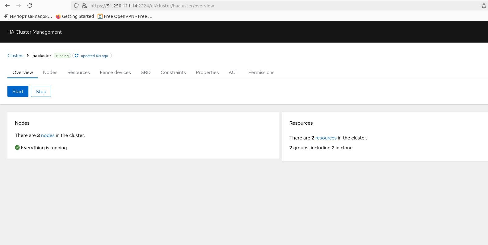
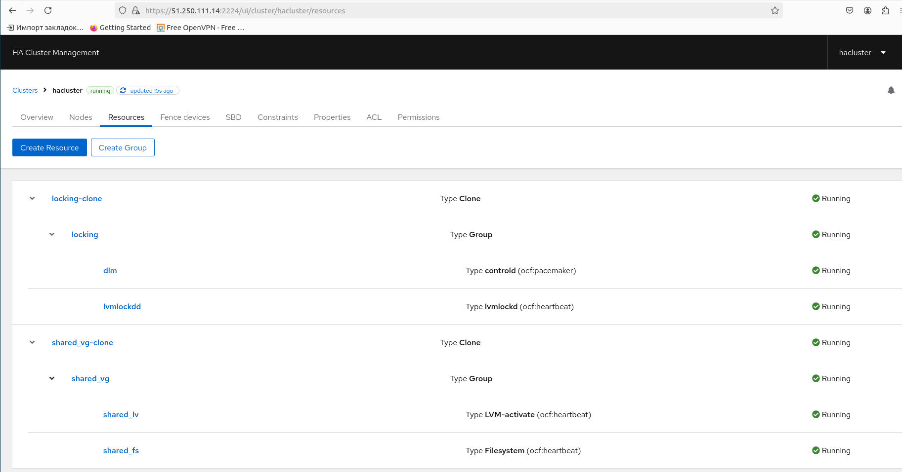

# Домашнее задание

## Создать ISCSI + GFS2 + Pacemaker terraform скрипт

### Цель: Реализовать cluster

## Описание/Пошаговая инструкция выполнения домашнего задания:

Необходимо:

1. Реализовать терраформ для разворачивания виртуалки в yandex-cloud

2. Запровиженить nginx с помощью ansible

### Формат сдачи

1. Репозиторий с терраформ манифестами

Критерии оценки:

Преподаватель с помощью terraform apply должен получить развернутый стенд.


К сожалению во многом рутинная боль отуса = это презентации к уроку (методички) устаревшие (основанные на версиях linux - deprecated)

И во многом в реализации ДЗ они только мешают, так как дают неверное направление поиска в котором тратится огромное количесвто времени.

Задание с pacemaker, c учетом слабого урока, отняло недопустимо большое количество времени.

Разочаровашись в презентации нашел хорошую инструкцию https://www.server-world.info/en/note?os=CentOS_Stream_9&p=pacemaker&f=1

В связи с эти описание будет сугубо утилитарным.


## Для проверки стенда потребуется.

Экспортировать переменные доступа к Yandex Cloud

```bash
export YC_TOKEN=$(yc iam create-token)
export YC_CLOUD_ID=$(yc config get cloud-id)
export YC_FOLDER_ID=$(yc config get folder-id)
```
из каталога tofu выполнить `tofu apply`


Итоговый стенд приведен к виду


```shell


05_1_iscsi_gfs2_pacemaker/
├── ansible
│   ├── ansible.cfg
│   ├── inventories
│   │   └── hosts
│   ├── playbooks
│   │   ├── 000_start.yml
│   │   ├── 00_all.yml
│   │   ├── 01_iscsi.yml
│   │   ├── 03_pacemaker.yml
│   │   ├── 04_iscsifencing
│   │   └── 05_gfs2_cluster
│   ├── requirements.yml
│   └── roles
│       ├── 00_all
│       │   └── tasks
│       │       └── main.yml
│       ├── 02_mpio_configure
│       │   ├── handlers
│       │   │   └── main.yml
│       │   └── tasks
│       │       └── main.yml
│       ├── 03_pacemaker
│       │   ├── handlers
│       │   │   └── main.yml
│       │   ├── tasks
│       │   │   └── main.yml
│       │   └── vars
│       │       └── main.yml
│       ├── 04_iscsifensing
│       │   ├── handlers
│       │   └── tasks
│       │       └── main.yml
│       ├── 05_gfs2_cluster
│       │   ├── handlers
│       │   │   └── main.yml
│       │   └── tasks
│       │       └── main.yml
│       ├── OndrejHome.iscsiadm
│       │   ├── defaults
│       │   │   └── main.yml
│       │   ├── handlers
│       │   │   └── main.yml
│       │   ├── library
│       │   │   └── iscsiadm_facts.py
│       │   ├── meta
│       │   │   └── main.yml
│       │   ├── README.md
│       │   ├── tasks
│       │   │   ├── connect_to_target.yml
│       │   │   └── main.yml
│       │   └── vars
│       │       ├── vars_RedHat_CentOS.yml
│       │       └── vars_SUSE_openSUSE.yml
│       ├── ondrejhome.targetcli
│       │   ├── defaults
│       │   │   └── main.yml
│       │   ├── handlers
│       │   │   └── main.yml
│       │   ├── LICENSE
│       │   ├── meta
│       │   │   └── main.yml
│       │   ├── README.md
│       │   ├── tasks
│       │   │   └── main.yml
│       │   └── vars
│       │       ├── main.yml
│       │       ├── vars_RedHat_CentOS.yml
│       │       ├── vars_SUSE_openSUSE.yml
│       │       ├── vars_SUSE_SLES11.yml
│       │       └── vars_SUSE_SLES12.yml
│       ├── ondrejhome.targetcli-modules
│       │   ├── library
│       │   │   ├── targetcli_backstore.py
│       │   │   ├── targetcli_iscsi_acl.py
│       │   │   ├── targetcli_iscsi_lun.py
│       │   │   ├── targetcli_iscsi_portуесal.py
│       │   │   └── targetcli_iscsi.py
│       │   ├── LICENSE
│       │   ├── meta
│       │   │   └── main.yml
│       │   └── README.md
│       └── OndrejHome.targetcli-modules
│           ├── library
│           │   ├── targetcli_backstore.py
│           │   ├── targetcli_iscsi_acl.py
│           │   ├── targetcli_iscsi_lun.py
│           │   ├── targetcli_iscsi_portal.py
│           │   └── targetcli_iscsi.py
│           ├── LICENSE
│           ├── meta
│           │   └── main.yml
│           └── README.md
├── images
├── opentofu.sh
├── README.MD
├── start.sh
└── tofu
    ├── ansible.tf
    ├── cloud-init.yml
    ├── images.tf
    ├── net.tf
    ├── outputs.tf
    ├── providers.tf
    ├── scripts
    │   └── waitssh.sh
    ├── templates
    │   └── inventory.tpl
    ├── terraform.tfstate
    ├── terraform.tfstate.backup
    ├── variables.tf
    ├── vm-gfs2node.tf
    └── vm-iscsitarget.tf


```

 И являет собой классчиеский пример хорошего ansible и классического bashsible.

Разделен на пять частей

00_all - установка chronyd и наполнение /etc/hosts нодами
01_iscsi - создание iscsi таргета и подключение нод к таргету (использована коллекция ниже)


```shell

sincere@sincere-ubuntuotus:~/otus/02_highload/lessons/05_1_iscsi_gfs2_pacemaker/ansible$ cat requirements.yml 
---
- src: ondrejhome.targetcli
- src: ondrejhome.targetcli-modules
- src: OndrejHome.iscsiadm

```

`ansible-galaxy install -r requirements.yml`

03_pacemaker - установка pacemaker и создание кластера hacluster с паролем password
04_iscsifensing - реализация fencing на основе доступа ноды к iscsi таргету. При недоступности - нода отправляется в рестарт сервисом watchdog
05_gfs2_cluster - создание кластерного ресурса shared_fs


Листинг работы opentofu и ansible

<details>

```shell

sincere@sincere-ubuntuotus:~/otus/02_highload/lessons/05_1_iscsi_gfs2_pacemaker/tofu$ tofu apply
data.yandex_compute_image.centos9: Reading...
data.yandex_compute_image.centos8: Reading...
data.yandex_compute_image.debian12: Reading...
data.yandex_compute_image.centos8: Read complete after 1s [id=fd8qfp90a5l0m3d2htrm]
data.yandex_compute_image.debian12: Read complete after 1s [id=fd8vebbfbuvol7cebgvv]
data.yandex_compute_image.centos9: Read complete after 1s [id=fd867uuirrtmtlelcsa7]

OpenTofu used the selected providers to generate the following
execution plan. Resource actions are indicated with the
following symbols:
  + create

OpenTofu will perform the following actions:

  # local_file.inventory will be created
  + resource "local_file" "inventory" {
      + content              = (known after apply)
      + content_base64sha256 = (known after apply)
      + content_base64sha512 = (known after apply)
      + content_md5          = (known after apply)
      + content_sha1         = (known after apply)
      + content_sha256       = (known after apply)
      + content_sha512       = (known after apply)
      + directory_permission = "0777"
      + file_permission      = "0644"
      + filename             = "./../ansible/inventories/hosts"
      + id                   = (known after apply)
    }

  # yandex_compute_disk.volumes[0] will be created
  + resource "yandex_compute_disk" "volumes" {
      + block_size  = 4096
      + created_at  = (known after apply)
      + folder_id   = (known after apply)
      + id          = (known after apply)
      + name        = "disk-iscsitarget-1"
      + product_ids = (known after apply)
      + size        = 1
      + status      = (known after apply)
      + type        = "network-hdd"
      + zone        = "ru-central1-b"
    }

  # yandex_compute_instance.iscsitarget[0] will be created
  + resource "yandex_compute_instance" "iscsitarget" {
      + created_at                = (known after apply)
      + folder_id                 = (known after apply)
      + fqdn                      = (known after apply)
      + gpu_cluster_id            = (known after apply)
      + hostname                  = "otus-iscsitarget-1"
      + id                        = (known after apply)
      + maintenance_grace_period  = (known after apply)
      + maintenance_policy        = (known after apply)
      + metadata                  = {
          + "enable-oslogin"     = "false"
          + "serial-port-enable" = "1"
          + "ssh-keys"           = <<-EOT
                devops:ssh-ed25519 AAAAC3NzaC1lZDI1NTE5AAAAIKmUhAyceqbbc3AivLkcg60EINDUgf8pTmvA0vnvs8gq sincere@sincere-ubuntuotus
            EOT
          + "user-data"          = <<-EOT
                #cloud-config
                users:
                  - name: devops
                    groups: sudo
                    shell: /bin/bash
                    sudo: ['ALL=(ALL) NOPASSWD:ALL'] 
                    ssh-authorized-keys:
                      - ssh-ed25519 AAAAC3NzaC1lZDI1NTE5AAAAIKmUhAyceqbbc3AivLkcg60EINDUgf8pTmvA0vnvs8gq sincere@sincere-ubuntuotus
                disable_root: true
                timezone: Europe/Moscow
                repo_update: true
                repo_upgrade: true
            EOT
        }
      + name                      = "otus-iscsitarget-1"
      + network_acceleration_type = "standard"
      + platform_id               = "standard-v1"
      + service_account_id        = (known after apply)
      + status                    = (known after apply)
      + zone                      = (known after apply)

      + boot_disk {
          + auto_delete = true
          + device_name = (known after apply)
          + disk_id     = (known after apply)
          + mode        = (known after apply)

          + initialize_params {
              + block_size  = (known after apply)
              + description = (known after apply)
              + image_id    = "fd867uuirrtmtlelcsa7"
              + name        = "boot-disk-iscsitarget-1"
              + size        = 10
              + snapshot_id = (known after apply)
              + type        = "network-hdd"
            }
        }

      + network_interface {
          + index              = 0
          + ip_address         = "10.100.0.254"
          + ipv4               = true
          + ipv6               = (known after apply)
          + ipv6_address       = (known after apply)
          + mac_address        = (known after apply)
          + nat                = true
          + nat_ip_address     = (known after apply)
          + nat_ip_version     = (known after apply)
          + security_group_ids = (known after apply)
          + subnet_id          = (known after apply)
        }
      + network_interface {
          + index              = 1
          + ip_address         = "10.200.0.254"
          + ipv4               = true
          + ipv6               = (known after apply)
          + ipv6_address       = (known after apply)
          + mac_address        = (known after apply)
          + nat                = false
          + nat_ip_address     = (known after apply)
          + nat_ip_version     = (known after apply)
          + security_group_ids = (known after apply)
          + subnet_id          = (known after apply)
        }
      + network_interface {
          + index              = 2
          + ip_address         = "10.201.0.254"
          + ipv4               = true
          + ipv6               = (known after apply)
          + ipv6_address       = (known after apply)
          + mac_address        = (known after apply)
          + nat                = false
          + nat_ip_address     = (known after apply)
          + nat_ip_version     = (known after apply)
          + security_group_ids = (known after apply)
          + subnet_id          = (known after apply)
        }

      + resources {
          + core_fraction = 5
          + cores         = 2
          + memory        = 2
        }

      + scheduling_policy {
          + preemptible = true
        }

      + secondary_disk {
          + auto_delete = false
          + device_name = (known after apply)
          + disk_id     = (known after apply)
          + mode        = "READ_WRITE"
        }
    }

  # yandex_compute_instance.node[0] will be created
  + resource "yandex_compute_instance" "node" {
      + created_at                = (known after apply)
      + folder_id                 = (known after apply)
      + fqdn                      = (known after apply)
      + gpu_cluster_id            = (known after apply)
      + hostname                  = "otus-node-1"
      + id                        = (known after apply)
      + maintenance_grace_period  = (known after apply)
      + maintenance_policy        = (known after apply)
      + metadata                  = {
          + "ssh-keys"  = <<-EOT
                devops:ssh-ed25519 AAAAC3NzaC1lZDI1NTE5AAAAIKmUhAyceqbbc3AivLkcg60EINDUgf8pTmvA0vnvs8gq sincere@sincere-ubuntuotus
            EOT
          + "user-data" = <<-EOT
                #cloud-config
                users:
                  - name: devops
                    groups: sudo
                    shell: /bin/bash
                    sudo: ['ALL=(ALL) NOPASSWD:ALL'] 
                    ssh-authorized-keys:
                      - ssh-ed25519 AAAAC3NzaC1lZDI1NTE5AAAAIKmUhAyceqbbc3AivLkcg60EINDUgf8pTmvA0vnvs8gq sincere@sincere-ubuntuotus
                disable_root: true
                timezone: Europe/Moscow
                repo_update: true
                repo_upgrade: true
            EOT
        }
      + name                      = "otus-node-1"
      + network_acceleration_type = "standard"
      + platform_id               = "standard-v1"
      + service_account_id        = (known after apply)
      + status                    = (known after apply)
      + zone                      = (known after apply)

      + boot_disk {
          + auto_delete = true
          + device_name = (known after apply)
          + disk_id     = (known after apply)
          + mode        = (known after apply)

          + initialize_params {
              + block_size  = (known after apply)
              + description = (known after apply)
              + image_id    = "fd867uuirrtmtlelcsa7"
              + name        = "boot-disk-node-1"
              + size        = 10
              + snapshot_id = (known after apply)
              + type        = "network-hdd"
            }
        }

      + network_interface {
          + index              = 0
          + ip_address         = "10.100.0.10"
          + ipv4               = true
          + ipv6               = (known after apply)
          + ipv6_address       = (known after apply)
          + mac_address        = (known after apply)
          + nat                = true
          + nat_ip_address     = (known after apply)
          + nat_ip_version     = (known after apply)
          + security_group_ids = (known after apply)
          + subnet_id          = (known after apply)
        }
      + network_interface {
          + index              = 1
          + ip_address         = "10.200.0.10"
          + ipv4               = true
          + ipv6               = (known after apply)
          + ipv6_address       = (known after apply)
          + mac_address        = (known after apply)
          + nat                = false
          + nat_ip_address     = (known after apply)
          + nat_ip_version     = (known after apply)
          + security_group_ids = (known after apply)
          + subnet_id          = (known after apply)
        }
      + network_interface {
          + index              = 2
          + ip_address         = "10.201.0.10"
          + ipv4               = true
          + ipv6               = (known after apply)
          + ipv6_address       = (known after apply)
          + mac_address        = (known after apply)
          + nat                = false
          + nat_ip_address     = (known after apply)
          + nat_ip_version     = (known after apply)
          + security_group_ids = (known after apply)
          + subnet_id          = (known after apply)
        }

      + resources {
          + core_fraction = 5
          + cores         = 2
          + memory        = 2
        }

      + scheduling_policy {
          + preemptible = true
        }
    }

  # yandex_compute_instance.node[1] will be created
  + resource "yandex_compute_instance" "node" {
      + created_at                = (known after apply)
      + folder_id                 = (known after apply)
      + fqdn                      = (known after apply)
      + gpu_cluster_id            = (known after apply)
      + hostname                  = "otus-node-2"
      + id                        = (known after apply)
      + maintenance_grace_period  = (known after apply)
      + maintenance_policy        = (known after apply)
      + metadata                  = {
          + "ssh-keys"  = <<-EOT
                devops:ssh-ed25519 AAAAC3NzaC1lZDI1NTE5AAAAIKmUhAyceqbbc3AivLkcg60EINDUgf8pTmvA0vnvs8gq sincere@sincere-ubuntuotus
            EOT
          + "user-data" = <<-EOT
                #cloud-config
                users:
                  - name: devops
                    groups: sudo
                    shell: /bin/bash
                    sudo: ['ALL=(ALL) NOPASSWD:ALL'] 
                    ssh-authorized-keys:
                      - ssh-ed25519 AAAAC3NzaC1lZDI1NTE5AAAAIKmUhAyceqbbc3AivLkcg60EINDUgf8pTmvA0vnvs8gq sincere@sincere-ubuntuotus
                disable_root: true
                timezone: Europe/Moscow
                repo_update: true
                repo_upgrade: true
            EOT
        }
      + name                      = "otus-node-2"
      + network_acceleration_type = "standard"
      + platform_id               = "standard-v1"
      + service_account_id        = (known after apply)
      + status                    = (known after apply)
      + zone                      = (known after apply)

      + boot_disk {
          + auto_delete = true
          + device_name = (known after apply)
          + disk_id     = (known after apply)
          + mode        = (known after apply)

          + initialize_params {
              + block_size  = (known after apply)
              + description = (known after apply)
              + image_id    = "fd867uuirrtmtlelcsa7"
              + name        = "boot-disk-node-2"
              + size        = 10
              + snapshot_id = (known after apply)
              + type        = "network-hdd"
            }
        }

      + network_interface {
          + index              = 0
          + ip_address         = "10.100.0.11"
          + ipv4               = true
          + ipv6               = (known after apply)
          + ipv6_address       = (known after apply)
          + mac_address        = (known after apply)
          + nat                = true
          + nat_ip_address     = (known after apply)
          + nat_ip_version     = (known after apply)
          + security_group_ids = (known after apply)
          + subnet_id          = (known after apply)
        }
      + network_interface {
          + index              = 1
          + ip_address         = "10.200.0.11"
          + ipv4               = true
          + ipv6               = (known after apply)
          + ipv6_address       = (known after apply)
          + mac_address        = (known after apply)
          + nat                = false
          + nat_ip_address     = (known after apply)
          + nat_ip_version     = (known after apply)
          + security_group_ids = (known after apply)
          + subnet_id          = (known after apply)
        }
      + network_interface {
          + index              = 2
          + ip_address         = "10.201.0.11"
          + ipv4               = true
          + ipv6               = (known after apply)
          + ipv6_address       = (known after apply)
          + mac_address        = (known after apply)
          + nat                = false
          + nat_ip_address     = (known after apply)
          + nat_ip_version     = (known after apply)
          + security_group_ids = (known after apply)
          + subnet_id          = (known after apply)
        }

      + resources {
          + core_fraction = 5
          + cores         = 2
          + memory        = 2
        }

      + scheduling_policy {
          + preemptible = true
        }
    }

  # yandex_compute_instance.node[2] will be created
  + resource "yandex_compute_instance" "node" {
      + created_at                = (known after apply)
      + folder_id                 = (known after apply)
      + fqdn                      = (known after apply)
      + gpu_cluster_id            = (known after apply)
      + hostname                  = "otus-node-3"
      + id                        = (known after apply)
      + maintenance_grace_period  = (known after apply)
      + maintenance_policy        = (known after apply)
      + metadata                  = {
          + "ssh-keys"  = <<-EOT
                devops:ssh-ed25519 AAAAC3NzaC1lZDI1NTE5AAAAIKmUhAyceqbbc3AivLkcg60EINDUgf8pTmvA0vnvs8gq sincere@sincere-ubuntuotus
            EOT
          + "user-data" = <<-EOT
                #cloud-config
                users:
                  - name: devops
                    groups: sudo
                    shell: /bin/bash
                    sudo: ['ALL=(ALL) NOPASSWD:ALL'] 
                    ssh-authorized-keys:
                      - ssh-ed25519 AAAAC3NzaC1lZDI1NTE5AAAAIKmUhAyceqbbc3AivLkcg60EINDUgf8pTmvA0vnvs8gq sincere@sincere-ubuntuotus
                disable_root: true
                timezone: Europe/Moscow
                repo_update: true
                repo_upgrade: true
            EOT
        }
      + name                      = "otus-node-3"
      + network_acceleration_type = "standard"
      + platform_id               = "standard-v1"
      + service_account_id        = (known after apply)
      + status                    = (known after apply)
      + zone                      = (known after apply)

      + boot_disk {
          + auto_delete = true
          + device_name = (known after apply)
          + disk_id     = (known after apply)
          + mode        = (known after apply)

          + initialize_params {
              + block_size  = (known after apply)
              + description = (known after apply)
              + image_id    = "fd867uuirrtmtlelcsa7"
              + name        = "boot-disk-node-3"
              + size        = 10
              + snapshot_id = (known after apply)
              + type        = "network-hdd"
            }
        }

      + network_interface {
          + index              = 0
          + ip_address         = "10.100.0.12"
          + ipv4               = true
          + ipv6               = (known after apply)
          + ipv6_address       = (known after apply)
          + mac_address        = (known after apply)
          + nat                = true
          + nat_ip_address     = (known after apply)
          + nat_ip_version     = (known after apply)
          + security_group_ids = (known after apply)
          + subnet_id          = (known after apply)
        }
      + network_interface {
          + index              = 1
          + ip_address         = "10.200.0.12"
          + ipv4               = true
          + ipv6               = (known after apply)
          + ipv6_address       = (known after apply)
          + mac_address        = (known after apply)
          + nat                = false
          + nat_ip_address     = (known after apply)
          + nat_ip_version     = (known after apply)
          + security_group_ids = (known after apply)
          + subnet_id          = (known after apply)
        }
      + network_interface {
          + index              = 2
          + ip_address         = "10.201.0.12"
          + ipv4               = true
          + ipv6               = (known after apply)
          + ipv6_address       = (known after apply)
          + mac_address        = (known after apply)
          + nat                = false
          + nat_ip_address     = (known after apply)
          + nat_ip_version     = (known after apply)
          + security_group_ids = (known after apply)
          + subnet_id          = (known after apply)
        }

      + resources {
          + core_fraction = 5
          + cores         = 2
          + memory        = 2
        }

      + scheduling_policy {
          + preemptible = true
        }
    }

  # yandex_vpc_network.data will be created
  + resource "yandex_vpc_network" "data" {
      + created_at                = (known after apply)
      + default_security_group_id = (known after apply)
      + folder_id                 = (known after apply)
      + id                        = (known after apply)
      + labels                    = (known after apply)
      + name                      = "data"
      + subnet_ids                = (known after apply)
    }

  # yandex_vpc_network.iscsi-net will be created
  + resource "yandex_vpc_network" "iscsi-net" {
      + created_at                = (known after apply)
      + default_security_group_id = (known after apply)
      + folder_id                 = (known after apply)
      + id                        = (known after apply)
      + labels                    = (known after apply)
      + name                      = "iscsi-net"
      + subnet_ids                = (known after apply)
    }

  # yandex_vpc_subnet.subnet-1 will be created
  + resource "yandex_vpc_subnet" "subnet-1" {
      + created_at     = (known after apply)
      + folder_id      = (known after apply)
      + id             = (known after apply)
      + labels         = (known after apply)
      + name           = "subnet1"
      + network_id     = (known after apply)
      + v4_cidr_blocks = [
          + "10.200.0.0/24",
        ]
      + v6_cidr_blocks = (known after apply)
      + zone           = "ru-central1-b"
    }

  # yandex_vpc_subnet.subnet-2 will be created
  + resource "yandex_vpc_subnet" "subnet-2" {
      + created_at     = (known after apply)
      + folder_id      = (known after apply)
      + id             = (known after apply)
      + labels         = (known after apply)
      + name           = "subnet2"
      + network_id     = (known after apply)
      + v4_cidr_blocks = [
          + "10.201.0.0/24",
        ]
      + v6_cidr_blocks = (known after apply)
      + zone           = "ru-central1-b"
    }

  # yandex_vpc_subnet.subnet-3 will be created
  + resource "yandex_vpc_subnet" "subnet-3" {
      + created_at     = (known after apply)
      + folder_id      = (known after apply)
      + id             = (known after apply)
      + labels         = (known after apply)
      + name           = "subnet3"
      + network_id     = (known after apply)
      + v4_cidr_blocks = [
          + "10.100.0.0/24",
        ]
      + v6_cidr_blocks = (known after apply)
      + zone           = "ru-central1-b"
    }

Plan: 11 to add, 0 to change, 0 to destroy.

Changes to Outputs:
  + otus-iscsitarget = [
      + {
          + fqdn                = (known after apply)
          + id                  = (known after apply)
          + internal_data_ip    = [
              + "10.100.0.254",
            ]
          + internal_iscsi_ip_1 = [
              + "10.200.0.254",
            ]
          + internal_iscsi_ip_2 = [
              + "10.201.0.254",
            ]
          + name                = "otus-iscsitarget-1"
          + public_ip           = [
              + (known after apply),
            ]
        },
    ]
  + otus-nodes       = [
      + {
          + fqdn                = (known after apply)
          + id                  = (known after apply)
          + internal_data_ip    = [
              + "10.100.0.10",
            ]
          + internal_iscsi_ip_0 = [
              + "10.200.0.10",
            ]
          + internal_iscsi_ip_1 = [
              + "10.201.0.10",
            ]
          + name                = "otus-node-1"
          + public_ip           = [
              + (known after apply),
            ]
        },
      + {
          + fqdn                = (known after apply)
          + id                  = (known after apply)
          + internal_data_ip    = [
              + "10.100.0.11",
            ]
          + internal_iscsi_ip_0 = [
              + "10.200.0.11",
            ]
          + internal_iscsi_ip_1 = [
              + "10.201.0.11",
            ]
          + name                = "otus-node-2"
          + public_ip           = [
              + (known after apply),
            ]
        },
      + {
          + fqdn                = (known after apply)
          + id                  = (known after apply)
          + internal_data_ip    = [
              + "10.100.0.12",
            ]
          + internal_iscsi_ip_0 = [
              + "10.200.0.12",
            ]
          + internal_iscsi_ip_1 = [
              + "10.201.0.12",
            ]
          + name                = "otus-node-3"
          + public_ip           = [
              + (known after apply),
            ]
        },
    ]

Do you want to perform these actions?
  OpenTofu will perform the actions described above.
  Only 'yes' will be accepted to approve.

  Enter a value: yes

yandex_vpc_network.iscsi-net: Creating...
yandex_vpc_network.data: Creating...
yandex_compute_disk.volumes[0]: Creating...
yandex_vpc_network.iscsi-net: Creation complete after 2s [id=enp0ih0mfs8mnu9t67da]
yandex_vpc_subnet.subnet-1: Creating...
yandex_vpc_subnet.subnet-2: Creating...
yandex_vpc_subnet.subnet-2: Creation complete after 1s [id=e2lv5c0jmr9d82lfiom8]
yandex_vpc_subnet.subnet-1: Creation complete after 1s [id=e2l72hido89uai6d6u7j]
yandex_vpc_network.data: Creation complete after 5s [id=enpnehr2j8g660qgmbfj]
yandex_vpc_subnet.subnet-3: Creating...
yandex_vpc_subnet.subnet-3: Creation complete after 0s [id=e2l3bbq21d5272le4vm9]
yandex_compute_disk.volumes[0]: Creation complete after 9s [id=epds7qsbgctbi0v4hgqb]
yandex_compute_instance.iscsitarget[0]: Creating...
yandex_compute_instance.iscsitarget[0]: Still creating... [10s elapsed]
yandex_compute_instance.iscsitarget[0]: Still creating... [20s elapsed]
yandex_compute_instance.iscsitarget[0]: Still creating... [30s elapsed]
yandex_compute_instance.iscsitarget[0]: Still creating... [40s elapsed]
yandex_compute_instance.iscsitarget[0]: Creation complete after 46s [id=epd28atrqj8ftk8jhp63]
yandex_compute_instance.node[1]: Creating...
yandex_compute_instance.node[0]: Creating...
yandex_compute_instance.node[2]: Creating...
yandex_compute_instance.node[0]: Still creating... [10s elapsed]
yandex_compute_instance.node[2]: Still creating... [10s elapsed]
yandex_compute_instance.node[1]: Still creating... [10s elapsed]
yandex_compute_instance.node[2]: Still creating... [20s elapsed]
yandex_compute_instance.node[0]: Still creating... [20s elapsed]
yandex_compute_instance.node[1]: Still creating... [20s elapsed]
yandex_compute_instance.node[1]: Still creating... [30s elapsed]
yandex_compute_instance.node[0]: Still creating... [30s elapsed]
yandex_compute_instance.node[2]: Still creating... [30s elapsed]
yandex_compute_instance.node[0]: Creation complete after 31s [id=epdekbboijmlolvgqd45]
yandex_compute_instance.node[2]: Creation complete after 35s [id=epd52gh1plrb00ebpkj7]
yandex_compute_instance.node[1]: Still creating... [40s elapsed]
yandex_compute_instance.node[1]: Creation complete after 41s [id=epde33o9414css580ohh]
local_file.inventory: Creating...
local_file.inventory: Provisioning with 'local-exec'...
local_file.inventory (local-exec): Executing: ["/bin/sh" "-c" "sleep 120"]
local_file.inventory: Still creating... [10s elapsed]
local_file.inventory: Still creating... [20s elapsed]
local_file.inventory: Still creating... [30s elapsed]
local_file.inventory: Still creating... [40s elapsed]
local_file.inventory: Still creating... [50s elapsed]
local_file.inventory: Still creating... [1m0s elapsed]
local_file.inventory: Still creating... [1m10s elapsed]
local_file.inventory: Still creating... [1m20s elapsed]
local_file.inventory: Still creating... [1m30s elapsed]
local_file.inventory: Still creating... [1m40s elapsed]
local_file.inventory: Still creating... [1m50s elapsed]
local_file.inventory: Still creating... [2m0s elapsed]
local_file.inventory: Provisioning with 'local-exec'...
local_file.inventory (local-exec): Executing: ["/bin/sh" "-c" "ANSIBLE_CONFIG=./../ansible/ansible.cfg ansible-playbook ./../ansible/playbooks/000_start.yml"]

local_file.inventory (local-exec): PLAY [Playbook of 00_all] ******************************************************

local_file.inventory (local-exec): TASK [Gathering Facts] *********************************************************
local_file.inventory (local-exec): ok: [otus-iscsitarget-1]
local_file.inventory (local-exec): ok: [otus-node-3]
local_file.inventory (local-exec): ok: [otus-node-1]
local_file.inventory (local-exec): ok: [otus-node-2]

local_file.inventory (local-exec): TASK [../roles/00_all : Install epel-release] **********************************
local_file.inventory: Still creating... [2m10s elapsed]
local_file.inventory: Still creating... [2m20s elapsed]
local_file.inventory: Still creating... [2m30s elapsed]
local_file.inventory (local-exec): changed: [otus-iscsitarget-1]
local_file.inventory (local-exec): changed: [otus-node-3]
local_file.inventory (local-exec): changed: [otus-node-2]
local_file.inventory (local-exec): changed: [otus-node-1]

local_file.inventory (local-exec): TASK [../roles/00_all : Check Base Packages] ***********************************
local_file.inventory: Still creating... [2m40s elapsed]
local_file.inventory: Still creating... [2m50s elapsed]
local_file.inventory: Still creating... [3m0s elapsed]
local_file.inventory (local-exec): ok: [otus-node-1] => (item={'package': 'chrony', 'state': 'present'})
local_file.inventory (local-exec): ok: [otus-node-2] => (item={'package': 'chrony', 'state': 'present'})
local_file.inventory (local-exec): ok: [otus-iscsitarget-1] => (item={'package': 'chrony', 'state': 'present'})
local_file.inventory (local-exec): ok: [otus-node-3] => (item={'package': 'chrony', 'state': 'present'})
local_file.inventory: Still creating... [3m10s elapsed]
local_file.inventory (local-exec): changed: [otus-node-1] => (item={'package': 'tree', 'state': 'present'})
local_file.inventory (local-exec): changed: [otus-iscsitarget-1] => (item={'package': 'tree', 'state': 'present'})
local_file.inventory (local-exec): changed: [otus-node-3] => (item={'package': 'tree', 'state': 'present'})
local_file.inventory: Still creating... [3m20s elapsed]
local_file.inventory (local-exec): changed: [otus-node-2] => (item={'package': 'tree', 'state': 'present'})
local_file.inventory (local-exec): changed: [otus-node-1] => (item={'package': 'tcpdump', 'state': 'present'})
local_file.inventory (local-exec): changed: [otus-iscsitarget-1] => (item={'package': 'tcpdump', 'state': 'present'})
local_file.inventory (local-exec): changed: [otus-node-3] => (item={'package': 'tcpdump', 'state': 'present'})
local_file.inventory: Still creating... [3m30s elapsed]
local_file.inventory (local-exec): changed: [otus-node-2] => (item={'package': 'tcpdump', 'state': 'present'})
local_file.inventory (local-exec): changed: [otus-node-1] => (item={'package': 'bind-utils', 'state': 'present'})
local_file.inventory (local-exec): changed: [otus-iscsitarget-1] => (item={'package': 'bind-utils', 'state': 'present'})
local_file.inventory (local-exec): changed: [otus-node-3] => (item={'package': 'bind-utils', 'state': 'present'})
local_file.inventory: Still creating... [3m40s elapsed]
local_file.inventory (local-exec): changed: [otus-node-2] => (item={'package': 'bind-utils', 'state': 'present'})

local_file.inventory (local-exec): TASK [../roles/00_all : Set hostname] ******************************************
local_file.inventory (local-exec): changed: [otus-node-3]
local_file.inventory (local-exec): changed: [otus-node-2]
local_file.inventory (local-exec): changed: [otus-node-1]
local_file.inventory (local-exec): changed: [otus-iscsitarget-1]

local_file.inventory (local-exec): TASK [../roles/00_all : Add node1 to /etc/hosts] *******************************
local_file.inventory (local-exec): skipping: [otus-node-1]
local_file.inventory (local-exec): changed: [otus-node-2]
local_file.inventory (local-exec): changed: [otus-node-3]
local_file.inventory (local-exec): changed: [otus-iscsitarget-1]

local_file.inventory (local-exec): TASK [../roles/00_all : Add node1 to /etc/hosts] *******************************
local_file.inventory (local-exec): skipping: [otus-node-2]
local_file.inventory (local-exec): changed: [otus-node-1]
local_file.inventory (local-exec): changed: [otus-iscsitarget-1]
local_file.inventory (local-exec): changed: [otus-node-3]

local_file.inventory (local-exec): TASK [../roles/00_all : Add node1 to /etc/hosts] *******************************
local_file.inventory (local-exec): skipping: [otus-node-3]
local_file.inventory (local-exec): changed: [otus-iscsitarget-1]
local_file.inventory (local-exec): changed: [otus-node-1]
local_file.inventory (local-exec): changed: [otus-node-2]

local_file.inventory (local-exec): PLAY [iscsiadm] ****************************************************************

local_file.inventory (local-exec): TASK [Gathering Facts] *********************************************************
local_file.inventory (local-exec): ok: [otus-node-3]
local_file.inventory (local-exec): ok: [otus-node-2]
local_file.inventory (local-exec): ok: [otus-node-1]

local_file.inventory (local-exec): TASK [OndrejHome.iscsiadm : Include RHEL/CentOS variables] *********************
local_file.inventory (local-exec): ok: [otus-node-1]
local_file.inventory (local-exec): ok: [otus-node-2]
local_file.inventory (local-exec): ok: [otus-node-3]

local_file.inventory (local-exec): TASK [OndrejHome.iscsiadm : Include SLES/openSUSE variable] ********************
local_file.inventory (local-exec): skipping: [otus-node-1]
local_file.inventory (local-exec): skipping: [otus-node-2]
local_file.inventory (local-exec): skipping: [otus-node-3]

local_file.inventory (local-exec): TASK [OndrejHome.iscsiadm : Install package(s) iscsi-initiator-utils] **********
local_file.inventory: Still creating... [3m50s elapsed]
local_file.inventory (local-exec): changed: [otus-node-3]
local_file.inventory (local-exec): changed: [otus-node-1]
local_file.inventory (local-exec): changed: [otus-node-2]

local_file.inventory (local-exec): TASK [OndrejHome.iscsiadm : Start and enable iscsid service] *******************
local_file.inventory (local-exec): changed: [otus-node-3]
local_file.inventory (local-exec): changed: [otus-node-2]
local_file.inventory (local-exec): changed: [otus-node-1]

local_file.inventory (local-exec): TASK [OndrejHome.iscsiadm : Set startup to automatic in /etc/iscsi/iscid.conf] ***
local_file.inventory (local-exec): ok: [otus-node-3]
local_file.inventory: Still creating... [4m0s elapsed]
local_file.inventory (local-exec): ok: [otus-node-1]
local_file.inventory (local-exec): ok: [otus-node-2]

local_file.inventory (local-exec): TASK [OndrejHome.iscsiadm : Collect facts about installed iSCSI initiator] *****
local_file.inventory (local-exec): ok: [otus-node-3]
local_file.inventory (local-exec): ok: [otus-node-1]
local_file.inventory (local-exec): ok: [otus-node-2]

local_file.inventory (local-exec): TASK [OndrejHome.iscsiadm : Setup iSCSI Initiator name] ************************
local_file.inventory (local-exec): changed: [otus-node-3]
local_file.inventory (local-exec): changed: [otus-node-1]
local_file.inventory (local-exec): changed: [otus-node-2]

local_file.inventory (local-exec): RUNNING HANDLER [OndrejHome.iscsiadm : restart service] ************************
local_file.inventory (local-exec): changed: [otus-node-3]
local_file.inventory (local-exec): changed: [otus-node-2]
local_file.inventory (local-exec): changed: [otus-node-1]

local_file.inventory (local-exec): TASK [OndrejHome.iscsiadm : Connect to iSCSI target] ***************************
local_file.inventory (local-exec): skipping: [otus-node-1]
local_file.inventory (local-exec): skipping: [otus-node-2]
local_file.inventory (local-exec): skipping: [otus-node-3]

local_file.inventory (local-exec): PLAY [iscsitarget] *************************************************************

local_file.inventory (local-exec): TASK [Gathering Facts] *********************************************************
local_file.inventory (local-exec): ok: [otus-iscsitarget-1]

local_file.inventory (local-exec): TASK [ondrejhome.targetcli : Include RHEL/CentOS variables] ********************
local_file.inventory (local-exec): ok: [otus-iscsitarget-1]

local_file.inventory (local-exec): TASK [ondrejhome.targetcli : Include SLES/OpenSUSE common variables] ***********
local_file.inventory (local-exec): skipping: [otus-iscsitarget-1]

local_file.inventory (local-exec): TASK [ondrejhome.targetcli : Include SLES12 variables] *************************
local_file.inventory (local-exec): skipping: [otus-iscsitarget-1]

local_file.inventory (local-exec): TASK [ondrejhome.targetcli : Include SLES11 variables (check README for limitations)] ***
local_file.inventory (local-exec): skipping: [otus-iscsitarget-1]

local_file.inventory (local-exec): TASK [ondrejhome.targetcli : Install package(s) targetcli] *********************
local_file.inventory: Still creating... [4m10s elapsed]
local_file.inventory (local-exec): changed: [otus-iscsitarget-1]

local_file.inventory (local-exec): TASK [ondrejhome.targetcli : Start and enable the target service] **************
local_file.inventory (local-exec): changed: [otus-iscsitarget-1]

local_file.inventory (local-exec): TASK [ondrejhome.targetcli : populate service facts] ***************************
local_file.inventory (local-exec): ok: [otus-iscsitarget-1]

local_file.inventory (local-exec): TASK [ondrejhome.targetcli : Warning about SLES12 firewall] ********************
local_file.inventory (local-exec): skipping: [otus-iscsitarget-1]

local_file.inventory (local-exec): TASK [ondrejhome.targetcli : Enable port 3260/tcp on firewalld] ****************
local_file.inventory (local-exec): skipping: [otus-iscsitarget-1]

local_file.inventory (local-exec): TASK [ondrejhome.targetcli : define backstore objects] *************************
local_file.inventory (local-exec): changed: [otus-iscsitarget-1] => (item=[{'wwn': 'iqn.1994-05.com.redhat:target', 'initiators': ['iqn.1994-05.com.redhat:8923b4591b44', 'iqn.1994-05.com.redhat:101512903a0', 'iqn.1994-05.com.redhat:38ac9f5bcd78']}, {'path': '/dev/vdb', 'name': 'disk01', 'type': 'block'}])

local_file.inventory (local-exec): TASK [ondrejhome.targetcli : create iSCSI targets] *****************************
local_file.inventory (local-exec): changed: [otus-iscsitarget-1] => (item={'wwn': 'iqn.1994-05.com.redhat:target', 'disks': [{'path': '/dev/vdb', 'name': 'disk01', 'type': 'block'}], 'initiators': ['iqn.1994-05.com.redhat:8923b4591b44', 'iqn.1994-05.com.redhat:101512903a0', 'iqn.1994-05.com.redhat:38ac9f5bcd78']})

local_file.inventory (local-exec): TASK [ondrejhome.targetcli : define ACLs for iSCSI target] *********************
local_file.inventory (local-exec): changed: [otus-iscsitarget-1] => (item=[{'wwn': 'iqn.1994-05.com.redhat:target', 'disks': [{'path': '/dev/vdb', 'name': 'disk01', 'type': 'block'}]}, 'iqn.1994-05.com.redhat:8923b4591b44'])
local_file.inventory: Still creating... [4m20s elapsed]
local_file.inventory (local-exec): changed: [otus-iscsitarget-1] => (item=[{'wwn': 'iqn.1994-05.com.redhat:target', 'disks': [{'path': '/dev/vdb', 'name': 'disk01', 'type': 'block'}]}, 'iqn.1994-05.com.redhat:101512903a0'])
local_file.inventory (local-exec): changed: [otus-iscsitarget-1] => (item=[{'wwn': 'iqn.1994-05.com.redhat:target', 'disks': [{'path': '/dev/vdb', 'name': 'disk01', 'type': 'block'}]}, 'iqn.1994-05.com.redhat:38ac9f5bcd78'])

local_file.inventory (local-exec): TASK [ondrejhome.targetcli : assing LUNs to initiators] ************************
local_file.inventory (local-exec): changed: [otus-iscsitarget-1] => (item=[{'wwn': 'iqn.1994-05.com.redhat:target', 'initiators': ['iqn.1994-05.com.redhat:8923b4591b44', 'iqn.1994-05.com.redhat:101512903a0', 'iqn.1994-05.com.redhat:38ac9f5bcd78']}, {'path': '/dev/vdb', 'name': 'disk01', 'type': 'block'}])

local_file.inventory (local-exec): RUNNING HANDLER [ondrejhome.targetcli : save targetcli configuration] **********
local_file.inventory (local-exec): changed: [otus-iscsitarget-1]

local_file.inventory (local-exec): PLAY [Connect  nodes to iSCSI target] ******************************************

local_file.inventory (local-exec): TASK [Gathering Facts] *********************************************************
local_file.inventory (local-exec): ok: [otus-node-3]
local_file.inventory (local-exec): ok: [otus-node-2]
local_file.inventory (local-exec): ok: [otus-node-1]

local_file.inventory (local-exec): TASK [Discover iSCSI target] ***************************************************
local_file.inventory (local-exec): changed: [otus-node-3]
local_file.inventory (local-exec): changed: [otus-node-1]
local_file.inventory (local-exec): changed: [otus-node-2]

local_file.inventory (local-exec): TASK [Start iSCSI initiators on clients] ***************************************
local_file.inventory (local-exec): ok: [otus-node-3]
local_file.inventory: Still creating... [4m30s elapsed]
local_file.inventory (local-exec): ok: [otus-node-2]
local_file.inventory (local-exec): ok: [otus-node-1]

local_file.inventory (local-exec): PLAY [Configure Multipath] *****************************************************

local_file.inventory (local-exec): TASK [Gathering Facts] *********************************************************
local_file.inventory (local-exec): ok: [otus-node-3]
local_file.inventory (local-exec): ok: [otus-node-1]
local_file.inventory (local-exec): ok: [otus-node-2]

local_file.inventory (local-exec): TASK [02_mpio_configure : Check Base Packages] *********************************
local_file.inventory: Still creating... [4m40s elapsed]
local_file.inventory (local-exec): changed: [otus-node-3] => (item={'package': 'device-mapper-multipath', 'state': 'present'})
local_file.inventory (local-exec): changed: [otus-node-1] => (item={'package': 'device-mapper-multipath', 'state': 'present'})
local_file.inventory (local-exec): changed: [otus-node-2] => (item={'package': 'device-mapper-multipath', 'state': 'present'})

local_file.inventory (local-exec): TASK [02_mpio_configure : Creating MPIO config file] ***************************
local_file.inventory (local-exec): changed: [otus-node-3] => (item=/sbin/mpathconf --enable)
local_file.inventory (local-exec): changed: [otus-node-1] => (item=/sbin/mpathconf --enable)
local_file.inventory (local-exec): changed: [otus-node-2] => (item=/sbin/mpathconf --enable)

local_file.inventory (local-exec): RUNNING HANDLER [02_mpio_configure : restart multipathd] ***********************
local_file.inventory (local-exec): changed: [otus-node-3]
local_file.inventory (local-exec): changed: [otus-node-1]
local_file.inventory (local-exec): changed: [otus-node-2]

local_file.inventory (local-exec): PLAY [Playbook of Install Pacemaker] *******************************************

local_file.inventory (local-exec): TASK [Gathering Facts] *********************************************************
local_file.inventory (local-exec): ok: [otus-node-3]
local_file.inventory (local-exec): ok: [otus-node-1]
local_file.inventory: Still creating... [4m50s elapsed]
local_file.inventory (local-exec): ok: [otus-node-2]

local_file.inventory (local-exec): TASK [03_pacemaker : Disable SELinux on all cluster nodes] *********************
local_file.inventory (local-exec): [WARNING]: SELinux state temporarily changed from 'enforcing' to 'permissive'.
local_file.inventory (local-exec): State change will take effect next reboot.
local_file.inventory (local-exec): changed: [otus-node-3]
local_file.inventory (local-exec): changed: [otus-node-1]
local_file.inventory (local-exec): changed: [otus-node-2]

local_file.inventory (local-exec): TASK [03_pacemaker : Install Pacemaker software] *******************************
local_file.inventory: Still creating... [5m0s elapsed]
local_file.inventory: Still creating... [5m10s elapsed]
local_file.inventory: Still creating... [5m20s elapsed]
local_file.inventory (local-exec): changed: [otus-node-3]
local_file.inventory: Still creating... [5m30s elapsed]
local_file.inventory: Still creating... [5m40s elapsed]
local_file.inventory: Still creating... [5m50s elapsed]
local_file.inventory (local-exec): changed: [otus-node-2]
local_file.inventory (local-exec): changed: [otus-node-1]

local_file.inventory (local-exec): TASK [03_pacemaker : Set password for cluster user "hacluster"] ****************
local_file.inventory (local-exec): changed: [otus-node-3]
local_file.inventory (local-exec): changed: [otus-node-1]
local_file.inventory (local-exec): changed: [otus-node-2]

local_file.inventory (local-exec): TASK [03_pacemaker : Enable Pacemaker service at startup] **********************
local_file.inventory (local-exec): changed: [otus-node-3]
local_file.inventory (local-exec): changed: [otus-node-2]
local_file.inventory (local-exec): changed: [otus-node-1]

local_file.inventory (local-exec): TASK [03_pacemaker : restart pcsd] *********************************************
local_file.inventory: Still creating... [6m0s elapsed]
local_file.inventory (local-exec): changed: [otus-node-3]
local_file.inventory: Still creating... [6m10s elapsed]
local_file.inventory (local-exec): changed: [otus-node-2]
local_file.inventory (local-exec): changed: [otus-node-1]

local_file.inventory (local-exec): TASK [03_pacemaker : Check for replay (/opt/pcs_config_done exists)] ***********
local_file.inventory (local-exec): ok: [otus-node-3]
local_file.inventory (local-exec): ok: [otus-node-2]
local_file.inventory (local-exec): ok: [otus-node-1]

local_file.inventory (local-exec): TASK [03_pacemaker : Configuring cluster (step 1) - auth host] *****************
local_file.inventory (local-exec): skipping: [otus-node-2] => (item=pcs host auth otus-node-1 otus-node-2 otus-node-3 -u hacluster -p password)
local_file.inventory (local-exec): skipping: [otus-node-3] => (item=pcs host auth otus-node-1 otus-node-2 otus-node-3 -u hacluster -p password)
local_file.inventory: Still creating... [6m20s elapsed]
local_file.inventory (local-exec): changed: [otus-node-1] => (item=pcs host auth otus-node-1 otus-node-2 otus-node-3 -u hacluster -p password)

local_file.inventory (local-exec): TASK [03_pacemaker : Configuring cluster (step 2) - setup and sync authkey] ****
local_file.inventory (local-exec): skipping: [otus-node-2] => (item=pcs cluster setup hacluster otus-node-1 otus-node-2 otus-node-3)
local_file.inventory (local-exec): skipping: [otus-node-3] => (item=pcs cluster setup hacluster otus-node-1 otus-node-2 otus-node-3)
local_file.inventory: Still creating... [6m30s elapsed]
local_file.inventory (local-exec): changed: [otus-node-1] => (item=pcs cluster setup hacluster otus-node-1 otus-node-2 otus-node-3)

local_file.inventory (local-exec): TASK [03_pacemaker : Configuring cluster (step 3) - start and enabled cluster] ***
local_file.inventory (local-exec): skipping: [otus-node-2] => (item=pcs cluster enable --all)
local_file.inventory (local-exec): skipping: [otus-node-2] => (item=pcs cluster start --all)
local_file.inventory (local-exec): skipping: [otus-node-3] => (item=pcs cluster enable --all)
local_file.inventory (local-exec): skipping: [otus-node-3] => (item=pcs cluster start --all)
local_file.inventory (local-exec): changed: [otus-node-1] => (item=pcs cluster enable --all)
local_file.inventory: Still creating... [6m40s elapsed]
local_file.inventory (local-exec): changed: [otus-node-1] => (item=pcs cluster start --all)

local_file.inventory (local-exec): PLAY [Playbook of Install iscsifensing] ****************************************

local_file.inventory (local-exec): TASK [Gathering Facts] *********************************************************
local_file.inventory (local-exec): ok: [otus-node-3]
local_file.inventory (local-exec): ok: [otus-node-2]
local_file.inventory (local-exec): ok: [otus-node-1]

local_file.inventory (local-exec): TASK [04_iscsifensing : Install iscsifence] ************************************
local_file.inventory: Still creating... [6m50s elapsed]
local_file.inventory: Still creating... [7m0s elapsed]
local_file.inventory: Still creating... [7m10s elapsed]
local_file.inventory (local-exec): changed: [otus-node-3]
local_file.inventory: Still creating... [7m20s elapsed]
local_file.inventory: Still creating... [7m30s elapsed]
local_file.inventory (local-exec): changed: [otus-node-1]
local_file.inventory: Still creating... [7m40s elapsed]
local_file.inventory (local-exec): changed: [otus-node-2]

local_file.inventory (local-exec): TASK [04_iscsifensing : Configuring iscsi_shooter] *****************************
local_file.inventory (local-exec): changed: [otus-node-3]
local_file.inventory (local-exec): changed: [otus-node-2]
local_file.inventory (local-exec): changed: [otus-node-1]

local_file.inventory (local-exec): TASK [04_iscsifensing : Enable Watchdog] ***************************************
local_file.inventory (local-exec): changed: [otus-node-3]
local_file.inventory (local-exec): changed: [otus-node-1]
local_file.inventory (local-exec): changed: [otus-node-2]

local_file.inventory (local-exec): TASK [04_iscsifensing : Check disk information] ********************************
local_file.inventory (local-exec): skipping: [otus-node-2]
local_file.inventory (local-exec): skipping: [otus-node-3]
local_file.inventory (local-exec): changed: [otus-node-1]

local_file.inventory (local-exec): TASK [04_iscsifensing : Check WWN ISCSI disk] **********************************
local_file.inventory (local-exec): ok: [otus-node-1] => {
local_file.inventory (local-exec):     "msg": "wwn-0x6001405b21461107c0348949f26ad184"
local_file.inventory (local-exec): }
local_file.inventory (local-exec): skipping: [otus-node-2]
local_file.inventory (local-exec): skipping: [otus-node-3]

local_file.inventory (local-exec): TASK [04_iscsifensing : Configuring Pacemaker Resource] ************************
local_file.inventory (local-exec): skipping: [otus-node-2]
local_file.inventory (local-exec): skipping: [otus-node-3]
local_file.inventory: Still creating... [7m50s elapsed]
local_file.inventory: Still creating... [8m0s elapsed]
local_file.inventory: Still creating... [8m10s elapsed]
local_file.inventory: Still creating... [8m20s elapsed]
local_file.inventory: Still creating... [8m30s elapsed]
local_file.inventory: Still creating... [8m40s elapsed]
local_file.inventory: Still creating... [8m50s elapsed]
local_file.inventory (local-exec): changed: [otus-node-1]

local_file.inventory (local-exec): PLAY [Install GFS2 and cLVM software] ******************************************

local_file.inventory (local-exec): TASK [Gathering Facts] *********************************************************
local_file.inventory (local-exec): ok: [otus-node-3]
local_file.inventory (local-exec): ok: [otus-node-1]
local_file.inventory (local-exec): ok: [otus-node-2]

local_file.inventory (local-exec): TASK [05_gfs2_cluster : Install GFS2 and cLVM software] ************************
local_file.inventory: Still creating... [9m0s elapsed]
local_file.inventory (local-exec): changed: [otus-node-3]
local_file.inventory (local-exec): changed: [otus-node-2]
local_file.inventory (local-exec): changed: [otus-node-1]

local_file.inventory (local-exec): TASK [05_gfs2_cluster : Enable use_lvmlockd = 1] *******************************
local_file.inventory: Still creating... [9m10s elapsed]
local_file.inventory (local-exec): changed: [otus-node-3]
local_file.inventory (local-exec): changed: [otus-node-2]
local_file.inventory (local-exec): changed: [otus-node-1]

local_file.inventory (local-exec): TASK [05_gfs2_cluster : Configuring cluster for use DLM,LockD and create GFS2 filesystem ( Step 1)] ***
local_file.inventory (local-exec): skipping: [otus-node-2]
local_file.inventory (local-exec): skipping: [otus-node-3]
local_file.inventory: Still creating... [9m20s elapsed]
local_file.inventory (local-exec): changed: [otus-node-1]

local_file.inventory (local-exec): TASK [05_gfs2_cluster : Configuring cluster for use DLM,LockD and create GFS2 filesystem ( Step 2) - Create PV and VG] ***
local_file.inventory (local-exec): skipping: [otus-node-2]
local_file.inventory (local-exec): skipping: [otus-node-3]
local_file.inventory: Still creating... [9m30s elapsed]
local_file.inventory (local-exec): changed: [otus-node-1]

local_file.inventory (local-exec): TASK [05_gfs2_cluster : Configuring cluster for use DLM,LockD and create GFS2 filesystem (Step 3)] ***
local_file.inventory (local-exec): skipping: [otus-node-1]
local_file.inventory (local-exec): changed: [otus-node-2]
local_file.inventory (local-exec): changed: [otus-node-3]

local_file.inventory (local-exec): TASK [05_gfs2_cluster : Configuring cluster for use DLM,LockD and create GFS2 filesystem ( Step 4) - Create LV] ***
local_file.inventory (local-exec): skipping: [otus-node-2]
local_file.inventory (local-exec): skipping: [otus-node-3]
local_file.inventory (local-exec): changed: [otus-node-1]

local_file.inventory (local-exec): TASK [05_gfs2_cluster : Configuring cluster for use DLM,LockD and create GFS2 filesystem ( Step 5) - Activate LVM] ***
local_file.inventory (local-exec): skipping: [otus-node-2]
local_file.inventory (local-exec): skipping: [otus-node-3]
local_file.inventory: Still creating... [9m40s elapsed]
local_file.inventory: Still creating... [9m50s elapsed]
local_file.inventory: Still creating... [10m0s elapsed]
local_file.inventory: Still creating... [10m10s elapsed]
local_file.inventory: Still creating... [10m20s elapsed]
local_file.inventory: Still creating... [10m30s elapsed]
local_file.inventory: Still creating... [10m40s elapsed]
local_file.inventory: Still creating... [10m50s elapsed]
local_file.inventory: Still creating... [11m0s elapsed]
local_file.inventory (local-exec): changed: [otus-node-1]

local_file.inventory (local-exec): TASK [05_gfs2_cluster : Check df -h  information] ******************************
local_file.inventory (local-exec): changed: [otus-node-1]
local_file.inventory: Still creating... [11m10s elapsed]
local_file.inventory (local-exec): changed: [otus-node-3]
local_file.inventory (local-exec): changed: [otus-node-2]

local_file.inventory (local-exec): TASK [05_gfs2_cluster : Check gfs2_info] ***************************************
local_file.inventory (local-exec): ok: [otus-node-1] => {
local_file.inventory (local-exec):     "msg": "Filesystem                  Type  Size  Used Avail Use% Mounted on\n/dev/mapper/vg_gfs2-lv_gfs2 gfs2 1020M   28M  993M   3% /home/gfs2-share"
local_file.inventory (local-exec): }
local_file.inventory (local-exec): ok: [otus-node-2] => {
local_file.inventory (local-exec):     "msg": "Filesystem                  Type  Size  Used Avail Use% Mounted on\n/dev/mapper/vg_gfs2-lv_gfs2 gfs2 1020M   28M  993M   3% /home/gfs2-share"
local_file.inventory (local-exec): }
local_file.inventory (local-exec): ok: [otus-node-3] => {
local_file.inventory (local-exec):     "msg": "Filesystem                  Type  Size  Used Avail Use% Mounted on\n/dev/mapper/vg_gfs2-lv_gfs2 gfs2 1020M   28M  993M   3% /home/gfs2-share"
local_file.inventory (local-exec): }

local_file.inventory (local-exec): PLAY RECAP *********************************************************************
local_file.inventory (local-exec): otus-iscsitarget-1         : ok=17   changed=13   unreachable=0    failed=0    skipped=5    rescued=0    ignored=0
local_file.inventory (local-exec): otus-node-1                : ok=47   changed=33   unreachable=0    failed=0    skipped=4    rescued=0    ignored=0
local_file.inventory (local-exec): otus-node-2                : ok=38   changed=25   unreachable=0    failed=0    skipped=13   rescued=0    ignored=0
local_file.inventory (local-exec): otus-node-3                : ok=38   changed=25   unreachable=0    failed=0    skipped=13   rescued=0    ignored=0

local_file.inventory: Creation complete after 11m10s [id=e24553677303f0f0ba4ed35d20593c5943f51ad0]

Apply complete! Resources: 11 added, 0 changed, 0 destroyed.

Outputs:

otus-iscsitarget = [
  {
    "fqdn" = "otus-iscsitarget-1.ru-central1.internal"
    "id" = "epd28atrqj8ftk8jhp63"
    "internal_data_ip" = [
      "10.100.0.254",
    ]
    "internal_iscsi_ip_1" = [
      "10.200.0.254",
    ]
    "internal_iscsi_ip_2" = [
      "10.201.0.254",
    ]
    "name" = "otus-iscsitarget-1"
    "public_ip" = [
      "51.250.110.224",
    ]
  },
]
otus-nodes = [
  {
    "fqdn" = "otus-node-1.ru-central1.internal"
    "id" = "epdekbboijmlolvgqd45"
    "internal_data_ip" = [
      "10.100.0.10",
    ]
    "internal_iscsi_ip_0" = [
      "10.200.0.10",
    ]
    "internal_iscsi_ip_1" = [
      "10.201.0.10",
    ]
    "name" = "otus-node-1"
    "public_ip" = [
      "51.250.111.14",
    ]
  },
  {
    "fqdn" = "otus-node-2.ru-central1.internal"
    "id" = "epde33o9414css580ohh"
    "internal_data_ip" = [
      "10.100.0.11",
    ]
    "internal_iscsi_ip_0" = [
      "10.200.0.11",
    ]
    "internal_iscsi_ip_1" = [
      "10.201.0.11",
    ]
    "name" = "otus-node-2"
    "public_ip" = [
      "89.169.166.240",
    ]
  },
  {
    "fqdn" = "otus-node-3.ru-central1.internal"
    "id" = "epd52gh1plrb00ebpkj7"
    "internal_data_ip" = [
      "10.100.0.12",
    ]
    "internal_iscsi_ip_0" = [
      "10.200.0.12",
    ]
    "internal_iscsi_ip_1" = [
      "10.201.0.12",
    ]
    "name" = "otus-node-3"
    "public_ip" = [
      "84.252.137.218",
    ]
  },
  
  ```
</details>

В каталоге images несколько скринов кластера

https://otus-node-x:2224





## Задание выполнено!


