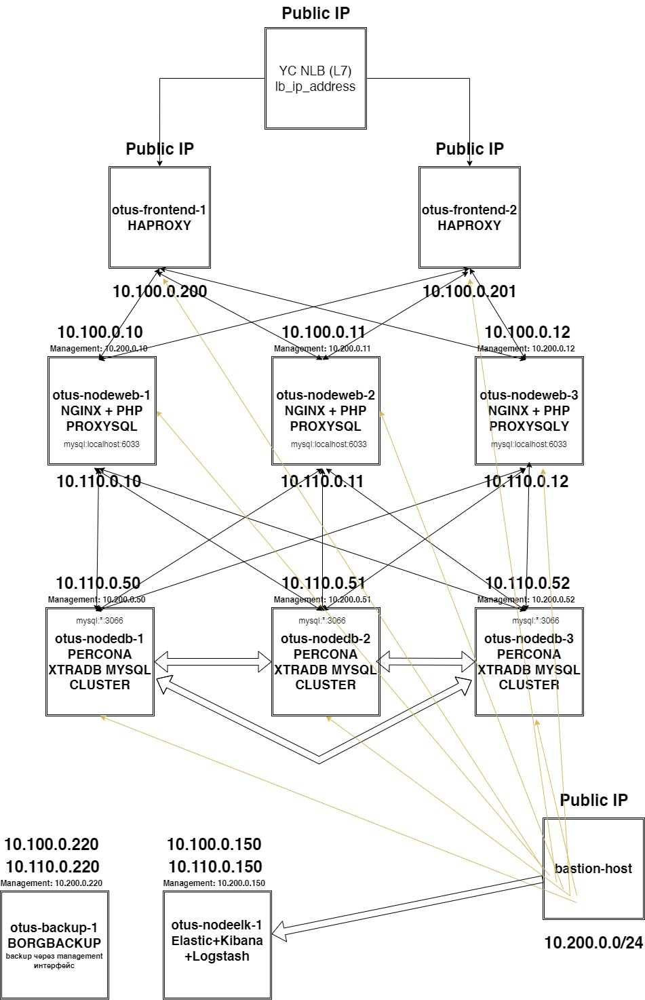

# Домашнее задание 99 отказоустойчивый кластер c Joomla на mysql cluster (ProxySQL + Percona XtraDB Cluster) с мониторингом и бэкапом

Развернуть InnoDB или PXC кластер

## Цель:
Перевести базу веб-проекта на один из вариантов кластера MySQL: Percona XtraDB Cluster или InnoDB Cluster.

### Описание/Пошаговая инструкция выполнения домашнего задания:

    Разворачиваем отказоустойчивый кластер MySQL (Percona XtraDB Cluster или InnoDB Cluster) на ВМ или в докере любым способом.
    Создаем внутри кластера вашу БД для проекта. Если требуется тестовая БД, то можно загрузить дамп здесь: [https://dev.mysql.com/doc/index-other.html]
    Для упрощения запуска можно использовать репозитории с плейбуками Ansible для PXC (https://github.com/Nickmob/vagrant_percona_cluster) и InnoDB Cluster (https://github.com/Nickmob/vagrant_innodb_cluster). Код в репозиториях рассчитан на Debian-based дистрибутивы.
    В качестве результата пришлите ссылку на ваш git-репозиторий с кодом и результатами запуска кластера.


### Критерии оценки:

Статус "Принято" ставится при успешном запуске одного из вариантов кластера с базой данных.


Схема стенда




## Выполнение

## Для проверки стенда потребуется.

Экспортировать переменные доступа к Yandex Cloud

```bash
export YC_TOKEN=$(yc iam create-token)
export YC_CLOUD_ID=$(yc config get cloud-id)
export YC_FOLDER_ID=$(yc config get folder-id)
```


Склонировать к себе  домашнее задание git clone URL

В задании используется коллекция gluster.volume

!!! Обязательно выполнить  ansible-galaxy collection install -r requirements.yml  из каталога ansible, в противном случае не соберется glusterfs.

из каталога tofu выполнить `tofu apply`


### Итоговый стенд приведен к виду

#### Сети:

``` shell

 yc-nlb (L7)  to frontend


frontend {
otus-frontend-1 10.100.0.200 to nodeweb
otus-frontend-2: 10.100.0.201 to nodeweb
}

nodesweb {

otus-nodeweb-1: 10.100.0.10 / otus-nodeweb-1-db: 10.110.0.10 to nodedb
otus-nodeweb-2: 10.100.0.11 / otus-nodeweb-1-db: 10.110.0.11 to nodedb
otus-nodeweb-3: 10.100.0.12 / otus-nodeweb-1-db: 10.110.0.12 to nodedb
}

nodesdb {
otus-nodedb-1: 10.110.0.50
otus-nodedb-1: 10.110.0.51
otus-nodedb-1: 10.110.0.52
}

nodeselk {
otus-nodeelk-1: 10.110.0.150
}

nodesbackup {
otus-nodebackup-1: 10.110.0.220
}

```                               


Сделана подсеть для менеджмента через bastion host и две отдельных подсети для web трафика и для трафика баз данных
Добавлен еще один frontend и yc nlb балансировщик.


#### Стенд созданный opentofu

``` shell

Outputs:

lb_ip_address = tolist([
  {
    "external_address_spec" = toset([
      {
        "address" = "158.160.134.110"
        "ip_version" = "ipv4"
      },
    ])
    "internal_address_spec" = toset([])
    "name" = "http"
    "port" = 80
    "protocol" = "tcp"
    "target_port" = 80
  },
])
otus-bastion = [
  {
    "fqdn" = "otus-bastion-1.ru-central1.internal"
    "id" = "epdrmh9cnksihc3pa99j"
    "internal_data_ip_manage" = [
      "10.201.0.16",
    ]
    "name" = "otus-bastion-1"
    "public_ip" = [
      "158.160.21.73",
    ]
  },
]
otus-frontend = [
  {
    "fqdn" = "otus-frontend-1.ru-central1.internal"
    "id" = "epdr1uipuqlm92j620f3"
    "internal_data_ip_manage" = [
      "10.200.0.200",
    ]
    "internal_data_ip_web" = [
      "10.100.0.200",
    ]
    "name" = "otus-frontend-1"
    "public_ip" = [
      "158.160.87.27",
    ]
  },
  {
    "fqdn" = "otus-frontend-2.ru-central1.internal"
    "id" = "epdcqmg3ca4j4ctnfblk"
    "internal_data_ip_manage" = [
      "10.200.0.201",
    ]
    "internal_data_ip_web" = [
      "10.100.0.201",
    ]
    "name" = "otus-frontend-2"
    "public_ip" = [
      "158.160.70.225",
    ]
  },
]
otus-nodebackup = [
  {
    "fqdn" = "otus-nodebackup-1.ru-central1.internal"
    "id" = "epdmq13albtk0b2c30ql"
    "internal_data_ip_db" = [
      "10.110.0.220",
    ]
    "internal_data_ip_manage" = [
      "10.200.0.220",
    ]
    "internal_data_ip_web" = [
      "10.100.0.220",
    ]
    "name" = "otus-nodebackup-1"
  },
]
otus-nodedb = [
  {
    "fqdn" = "otus-nodedb-1.ru-central1.internal"
    "id" = "epdu7egnv11pfnjeijvm"
    "internal_data_ip_db" = [
      "10.110.0.50",
    ]
    "internal_data_ip_manage" = [
      "10.200.0.50",
    ]
    "name" = "otus-nodedb-1"
  },
  {
    "fqdn" = "otus-nodedb-2.ru-central1.internal"
    "id" = "epdkmp7i3jtjod8ngh24"
    "internal_data_ip_db" = [
      "10.110.0.51",
    ]
    "internal_data_ip_manage" = [
      "10.200.0.51",
    ]
    "name" = "otus-nodedb-2"
  },
  {
    "fqdn" = "otus-nodedb-3.ru-central1.internal"
    "id" = "epda4j5u6g1qoabu8fim"
    "internal_data_ip_db" = [
      "10.110.0.52",
    ]
    "internal_data_ip_manage" = [
      "10.200.0.52",
    ]
    "name" = "otus-nodedb-3"
  },
]
otus-nodeweb = [
  {
    "fqdn" = "otus-nodeweb-1.ru-central1.internal"
    "id" = "epdts1fh2nvsvu8gqr88"
    "internal_data_ip_db" = [
      "10.110.0.10",
    ]
    "internal_data_ip_manage" = [
      "10.200.0.10",
    ]
    "internal_data_ip_web" = [
      "10.100.0.10",
    ]
    "name" = "otus-nodeweb-1"
  },
  {
    "fqdn" = "otus-nodeweb-2.ru-central1.internal"
    "id" = "epdcpcq1hcusitpn99fe"
    "internal_data_ip_db" = [
      "10.110.0.11",
    ]
    "internal_data_ip_manage" = [
      "10.200.0.11",
    ]
    "internal_data_ip_web" = [
      "10.100.0.11",
    ]
    "name" = "otus-nodeweb-2"
  },
  {
    "fqdn" = "otus-nodeweb-3.ru-central1.internal"
    "id" = "epd4vj5u4kq6k6jlmlne"
    "internal_data_ip_db" = [
      "10.110.0.12",
    ]
    "internal_data_ip_manage" = [
      "10.200.0.12",
    ]
    "internal_data_ip_web" = [
      "10.100.0.12",
    ]
    "name" = "otus-nodeweb-3"
  },
]


```

### Дерево проекта

```shell

.
├── ansible
│   ├── ansible.cfg
│   ├── group_vars
│   │   └── all
│   │       └── main.yml
│   ├── inventories
│   │   ├── hosts
│   │   └── hostsmanual
│   ├── playbooks
│   │   ├── 000_start.yml
│   │   ├── 001_bastion.yml
│   │   ├── 002_base.yml
│   │   ├── 003_haproxy_frontend.yml
│   │   ├── 003_nginx_frontend.yml
│   │   ├── 004_backend_glusterfs.yml
│   │   ├── 005_nginx_backend.yml
│   │   ├── 006_install_database_mysql.yml
│   │   ├── 007_install_proxysql.yml
│   │   ├── 009_install_elk.yml
│   │   ├── 010_install_filebeat.yml
│   │   ├── 014_install_nftables.yml
│   │   ├── 015_backupserver.yml
│   │   ├── 015_dataservers.yml
│   │   └── test.yml
│   ├── requirements.yml
│   ├── roles
│   │   ├── 001_bastion
│   │   │   ├── handlers
│   │   │   │   └── main.yml
│   │   │   ├── tasks
│   │   │   │   ├── main.yml
│   │   │   │   └── nginx.yml
│   │   │   ├── templates
│   │   │   │   ├── app.conf.j2
│   │   │   │   └── nginx.conf.j2
│   │   │   └── vars
│   │   │       └── main.yml
│   │   ├── 002_base
│   │   │   ├── handlers
│   │   │   │   └── main.yml
│   │   │   ├── tasks
│   │   │   │   └── main.yml
│   │   │   └── templates
│   │   │       └── hosts.j2
│   │   ├── 003_haproxy_frontend
│   │   │   ├── handlers
│   │   │   ├── tasks
│   │   │   │   ├── haproxy.yml
│   │   │   │   ├── keepalived.yml
│   │   │   │   └── main.yml
│   │   │   ├── templates
│   │   │   │   ├── haproxy.cfg
│   │   │   │   ├── keepalived.conf.j2
│   │   │   │   └── rsyslog_49_haproxy.conf
│   │   │   └── vars
│   │   │       └── main.yml
│   │   ├── 003_nginx_frontend
│   │   │   ├── handlers
│   │   │   │   └── main.yml
│   │   │   ├── tasks
│   │   │   │   └── main.yml
│   │   │   ├── templates
│   │   │   │   ├── app.conf.j2
│   │   │   │   └── nginx.conf.j2
│   │   │   └── vars
│   │   │       └── main.yml
│   │   ├── 004_backend_glusterfs
│   │   │   ├── handlers
│   │   │   │   └── main.yml
│   │   │   ├── tasks
│   │   │   │   └── main.yml
│   │   │   ├── templates
│   │   │   └── vars
│   │   │       └── main.yml
│   │   ├── 005_nginx_backend
│   │   │   ├── handlers
│   │   │   │   └── main.yml
│   │   │   ├── tasks
│   │   │   │   ├── joomla.yml
│   │   │   │   ├── main.yml
│   │   │   │   ├── php-fpm.yml
│   │   │   │   └── wordpress.yml
│   │   │   ├── templates
│   │   │   │   ├── app.conf.j2
│   │   │   │   ├── check.php.j2
│   │   │   │   ├── index.html.j2
│   │   │   │   ├── index.php.j2
│   │   │   │   ├── nginx.conf.j2
│   │   │   │   └── wp-config.php.j2
│   │   │   └── vars
│   │   │       └── main.yml
│   │   ├── 006_install_database_mysql
│   │   │   ├── etc
│   │   │   │   ├── LICENSE
│   │   │   │   └── ssl
│   │   │   │       ├── ca.pem
│   │   │   │       ├── server-cert.pem
│   │   │   │       └── server-key.pem
│   │   │   ├── handlers
│   │   │   │   └── main.yml
│   │   │   ├── tasks
│   │   │   │   ├── bootstrap_cluster.yml
│   │   │   │   ├── check-settings-centos.yml
│   │   │   │   ├── check-settings.yml
│   │   │   │   ├── configure-centos.yml
│   │   │   │   ├── configure.yml
│   │   │   │   ├── databases.yml
│   │   │   │   ├── install-centos.yml
│   │   │   │   ├── install.yml
│   │   │   │   ├── main.yml
│   │   │   │   ├── secure.yml
│   │   │   │   └── users.yml
│   │   │   ├── templates
│   │   │   │   ├── etc_my.cnf-centos.j2
│   │   │   │   ├── etc_mysql_my.cnf.j2
│   │   │   │   ├── etc_mysql_mysqld.cnf.j2
│   │   │   │   └── root-my-cnf.j2
│   │   │   └── vars
│   │   │       └── main.yml
│   │   ├── 007_install_proxysql
│   │   │   ├── handlers
│   │   │   │   └── main.yml
│   │   │   ├── tasks
│   │   │   │   ├── check_vars.yml
│   │   │   │   ├── configure_proxysql.yml
│   │   │   │   ├── install_proxysql.yml
│   │   │   │   └── main.yml
│   │   │   ├── templates
│   │   │   │   ├── proxysql.cnf.j2
│   │   │   │   ├── proxysql.logrotate.conf.j2
│   │   │   │   └── proxysql.my.cnf.j2
│   │   │   └── vars
│   │   │       └── main.yml
│   │   ├── 009_install_elk
│   │   │   ├── handlers
│   │   │   │   └── main.yml
│   │   │   ├── README.MD
│   │   │   ├── tasks
│   │   │   │   ├── install_elastic.yml
│   │   │   │   ├── install_filebeat.yml
│   │   │   │   ├── install_kibana.yml
│   │   │   │   ├── install_logstash.yml
│   │   │   │   └── main.yml
│   │   │   ├── templates
│   │   │   │   ├── elasticsearch.yml.j2
│   │   │   │   ├── filebeat.yml.j2
│   │   │   │   ├── jvm_mem.options.j2
│   │   │   │   ├── kibana.yml.j2
│   │   │   │   ├── logstash_itself.conf.j2
│   │   │   │   └── logstash_nginx.conf.j2
│   │   │   └── vars
│   │   │       └── main.yml
│   │   ├── 010_install_filebeat
│   │   │   ├── handlers
│   │   │   │   └── main.yml
│   │   │   ├── README.MD
│   │   │   ├── tasks
│   │   │   │   ├── install_filebeat.yml
│   │   │   │   └── main.yml
│   │   │   ├── templates
│   │   │   │   ├── filebeat_haproxy.yml.j2
│   │   │   │   ├── filebeat_nginx.yml.j2
│   │   │   │   ├── modules_haproxy.yml.j2
│   │   │   │   └── modules_nginx.yml.j2
│   │   │   └── vars
│   │   │       └── main.yml
│   │   ├── 012_install_prometeus
│   │   │   ├── handlers
│   │   │   │   └── main.yml
│   │   │   ├── README.MD
│   │   │   ├── tasks
│   │   │   │   ├── install_filebeat.yml
│   │   │   │   └── main.yml
│   │   │   ├── templates
│   │   │   │   ├── filebeat_haproxy.yml.j2
│   │   │   │   ├── filebeat_nginx.yml.j2
│   │   │   │   ├── modules_haproxy.yml.j2
│   │   │   │   └── modules_nginx.yml.j2
│   │   │   └── vars
│   │   │       └── main.yml
│   │   ├── 014_install_nftables
│   │   │   ├── handlers
│   │   │   │   └── main.yml
│   │   │   ├── README.MD
│   │   │   ├── tasks
│   │   │   │   ├── install_nftables.yml
│   │   │   │   └── main.yml
│   │   │   ├── templates
│   │   │   │   ├── nftables_frontend.conf.j2
│   │   │   │   ├── nftables_nodesdb.conf.j2
│   │   │   │   └── nftables_nodesweb.conf.j2
│   │   │   └── vars
│   │   │       └── main.yml
│   │   ├── 015_backupserver
│   │   │   ├── files
│   │   │   │   ├── id_rsa.pub
│   │   │   │   └── nftables.conf
│   │   │   ├── handlers
│   │   │   │   └── main.yml
│   │   │   ├── tasks
│   │   │   │   └── main.yml
│   │   │   └── vars
│   │   │       └── main.yml
│   │   └── 015_dataservers
│   │       ├── files
│   │       │   ├── borg-backup-frontend.sh
│   │       │   ├── borg-backup-nodesdb.sh
│   │       │   ├── borg-backup-nodesweb.sh
│   │       │   ├── borg-backup.service
│   │       │   ├── borg-backup.timer
│   │       │   ├── id_rsa
│   │       │   ├── id_rsa.pub
│   │       │   └── old
│   │       │       ├── borg-backup-database.sh
│   │       │       ├── borg-backup-node222.sh
│   │       │       ├── borg-backup-node225.sh
│   │       │       ├── borg-backup-nodeX.sh
│   │       │       ├── borg-backup-rsyslog1.sh
│   │       │       ├── borg-backup-web2.sh
│   │       │       └── borg-backup-zabbix.sh
│   │       ├── handlers
│   │       │   └── main.yml
│   │       ├── tasks
│   │       │   └── main.yml
│   │       └── vars
│   │           └── main.yml
│   └── terraform.tfstate
├── images
├── opentofu.sh
├── README.MD
├── start.sh
└── tofu
    ├── ansible.tf
    ├── cloud-init.yml
    ├── images.tf
    ├── net.tf
    ├── outputs.tf
    ├── providers.tf
    ├── route-table.tf
    ├── scripts
    │   └── waitssh.sh
    ├── security-group.tf
    ├── templates
    │   ├── group_vars_all.tpl
    │   └── inventory.tpl
    ├── terraform.tfstate
    ├── terraform.tfstate.backup
    ├── variables.tf
    ├── vm-backend_etcd.tf.notuse
    ├── vm-bastion.tf
    ├── vm-frontend.tf
    ├── vm-nlb.tf
    ├── vm-nodebackup.tf
    ├── vm-nodedb.tf
    ├── vm-nodeelk.tf
    ├── vm-nodeprom.tf
    └── vm-nodeweb.tf

82 directories, 175 files

```

Весь проект разделен на пять частей

- 000_start - запуск всех плейбуков
- 001_bastion - настройка хоста bastion - задел на будущее - в данной работе используется готовый nat instane
- 002_base - базовые пакеты chronyd сетевая аналитика
- 003_haproxy-frontend - базовая настройка haproxy для апстрим  - используется ip hash
- 004_backend_glusterfs - создание кластеризованой реплицируемой fs на базе glusterfs 
- 005_nginx_backend - ставится joomla (есть опция развернуть wordpress)
- 006_install_database_mysql - Установка и настройка Percona XtraDB Cluster, создание пользователей для ProxySQL, Wordpress и создание БД для wordpres. 
- 007_install_proxysql - установка ProxySQL - обратите внимание что ProxySQL ставится на nginx backend  -чтобы избежать необходимости установки еще одного промежуточного балансировщика. На мой взягляд отказоустойчивость обеспечена в этом случае в полном объеме.
- 009_install_elk - установка некластеризованного elk
- 010_install_filebeat - установка filebeat и настройка выгрузки на elk (через logstash)
- 014_install_nftables - настройка firewall на нодах
- 015_backupserver - настройка borgbackup сервера
- 015_dataservers - настройка borg-backup клиента и конфигурирование.


#### Листинг работы opentofu и ansible

<details>

```shell

Очень большой лог и не стал добавлять весь


PLAY RECAP *****************************************************************************************************************************************************************
otus-bastion-1             : ok=32   changed=23   unreachable=0    failed=0    skipped=47   rescued=0    ignored=0   
otus-frontend-1            : ok=41   changed=29   unreachable=0    failed=0    skipped=50   rescued=0    ignored=0   
otus-frontend-2            : ok=41   changed=29   unreachable=0    failed=0    skipped=50   rescued=0    ignored=0   
otus-nodebackup-1          : ok=12   changed=8    unreachable=0    failed=0    skipped=43   rescued=0    ignored=0   
otus-nodedb-1              : ok=64   changed=37   unreachable=0    failed=0    skipped=50   rescued=0    ignored=0   
otus-nodedb-2              : ok=37   changed=21   unreachable=0    failed=1    skipped=46   rescued=0    ignored=0   
otus-nodedb-3              : ok=57   changed=33   unreachable=0    failed=0    skipped=52   rescued=0    ignored=0   
otus-nodeelk-1             : ok=39   changed=22   unreachable=0    failed=0    skipped=43   rescued=0    ignored=0   
otus-nodeweb-1             : ok=88   changed=69   unreachable=0    failed=0    skipped=22   rescued=0    ignored=0   
otus-nodeweb-2             : ok=82   changed=63   unreachable=0    failed=0    skipped=28   rescued=0    ignored=0   
otus-nodeweb-3             : ok=82   changed=64   unreachable=0    failed=0    skipped=28   rescued=0    ignored=0   

```

</details>


Итогом запуска станет готовая к финальной настройке joomla на интерфейсе nlb балансировщика.
По адресу bastion:7000 будет доступен web интерфейс elasticбудет админка балансировщика haproxy
По адресу bastion:80 будет доступен web интерфейс elastic
По адресу bastion:443 будет доступен web интерфейс grafana (dash 9990)


```shell

devops@otus-nodedb-1:~$ sudo -s
root@otus-nodedb-1:/home/devops# mysql
Welcome to the MySQL monitor.  Commands end with ; or \g.
Your MySQL connection id is 485
Server version: 8.0.36-28.1 Percona XtraDB Cluster (GPL), Release rel28, Revision bfb687f, WSREP version 26.1.4.3

Copyright (c) 2009-2024 Percona LLC and/or its affiliates
Copyright (c) 2000, 2024, Oracle and/or its affiliates.

Oracle is a registered trademark of Oracle Corporation and/or its
affiliates. Other names may be trademarks of their respective
owners.

Type 'help;' or '\h' for help. Type '\c' to clear the current input statement.

mysql> show status like 'wsrep%';
+----------------------------------+------------------------------------------------------------------------------------------------------------------------------------------------+
| Variable_name                    | Value                                                                                                                                          |
+----------------------------------+------------------------------------------------------------------------------------------------------------------------------------------------+
| wsrep_local_state_uuid           | f6816bd1-72b7-11ef-9023-07a9b5465b3d                                                                                                           |
| wsrep_protocol_version           | 11                                                                                                                                             |
| wsrep_last_applied               | 277                                                                                                                                            |
| wsrep_last_committed             | 277                                                                                                                                            |
| wsrep_monitor_status (L/A/C)     | [ (277, 277), (277, 277), (277, 277) ]                                                                                                         |
| wsrep_replicated                 | 32                                                                                                                                             |
| wsrep_replicated_bytes           | 62696                                                                                                                                          |
| wsrep_repl_keys                  | 145                                                                                                                                            |
| wsrep_repl_keys_bytes            | 1928                                                                                                                                           |
| wsrep_repl_data_bytes            | 58613                                                                                                                                          |
| wsrep_repl_other_bytes           | 0                                                                                                                                              |
| wsrep_received                   | 244                                                                                                                                            |
| wsrep_received_bytes             | 3384808                                                                                                                                        |
| wsrep_local_commits              | 29                                                                                                                                             |
| wsrep_local_cert_failures        | 0                                                                                                                                              |
| wsrep_local_replays              | 0                                                                                                                                              |
| wsrep_local_send_queue           | 0                                                                                                                                              |
| wsrep_local_send_queue_max       | 2                                                                                                                                              |
| wsrep_local_send_queue_min       | 0                                                                                                                                              |
| wsrep_local_send_queue_avg       | 0.027027                                                                                                                                       |
| wsrep_local_recv_queue           | 0                                                                                                                                              |
| wsrep_local_recv_queue_max       | 40                                                                                                                                             |
| wsrep_local_recv_queue_min       | 0                                                                                                                                              |
| wsrep_local_recv_queue_avg       | 3.58197                                                                                                                                        |
| wsrep_local_cached_downto        | 1                                                                                                                                              |
| wsrep_flow_control_paused_ns     | 0                                                                                                                                              |
| wsrep_flow_control_paused        | 0                                                                                                                                              |
| wsrep_flow_control_sent          | 0                                                                                                                                              |
| wsrep_flow_control_recv          | 0                                                                                                                                              |
| wsrep_flow_control_active        | false                                                                                                                                          |
| wsrep_flow_control_requested     | false                                                                                                                                          |
| wsrep_flow_control_interval      | [ 173, 173 ]                                                                                                                                   |
| wsrep_flow_control_interval_low  | 173                                                                                                                                            |
| wsrep_flow_control_interval_high | 173                                                                                                                                            |
| wsrep_flow_control_status        | OFF                                                                                                                                            |
| wsrep_cert_deps_distance         | 1.00369                                                                                                                                        |
| wsrep_apply_oooe                 | 0                                                                                                                                              |
| wsrep_apply_oool                 | 0                                                                                                                                              |
| wsrep_apply_window               | 2.18315                                                                                                                                        |
| wsrep_apply_waits                | 80                                                                                                                                             |
| wsrep_commit_oooe                | 0                                                                                                                                              |
| wsrep_commit_oool                | 0                                                                                                                                              |
| wsrep_commit_window              | 1                                                                                                                                              |
| wsrep_local_state                | 4                                                                                                                                              |
| wsrep_local_state_comment        | Synced                                                                                                                                         |
| wsrep_cert_index_size            | 23                                                                                                                                             |
| wsrep_cert_bucket_count          | 257                                                                                                                                            |
| wsrep_gcache_pool_size           | 3457152                                                                                                                                        |
| wsrep_causal_reads               | 0                                                                                                                                              |
| wsrep_cert_interval              | 0.00369004                                                                                                                                     |
| wsrep_open_transactions          | 0                                                                                                                                              |
| wsrep_open_connections           | 0                                                                                                                                              |
| wsrep_ist_receive_status         |                                                                                                                                                |
| wsrep_ist_receive_seqno_start    | 0                                                                                                                                              |
| wsrep_ist_receive_seqno_current  | 0                                                                                                                                              |
| wsrep_ist_receive_seqno_end      | 0                                                                                                                                              |
| wsrep_incoming_addresses         | 10.110.0.51:3306,10.110.0.52:3306,10.110.0.50:3306                                                                                             |
| wsrep_cluster_weight             | 3                                                                                                                                              |
| wsrep_desync_count               | 0                                                                                                                                              |
| wsrep_evs_delayed                |                                                                                                                                                |
| wsrep_evs_evict_list             |                                                                                                                                                |
| wsrep_evs_repl_latency           | 0/0/0/0/0                                                                                                                                      |
| wsrep_evs_state                  | OPERATIONAL                                                                                                                                    |
| wsrep_gcomm_uuid                 | 42360ff4-72bc-11ef-8e78-1e8190ec2f7e                                                                                                           |
| wsrep_gmcast_segment             | 0                                                                                                                                              |
| wsrep_cluster_capabilities       |                                                                                                                                                |
| wsrep_cluster_conf_id            | 5                                                                                                                                              |
| wsrep_cluster_size               | 3                                                                                                                                              |
| wsrep_cluster_state_uuid         | f6816bd1-72b7-11ef-9023-07a9b5465b3d                                                                                                           |
| wsrep_cluster_status             | Primary                                                                                                                                        |
| wsrep_connected                  | ON                                                                                                                                             |
| wsrep_local_bf_aborts            | 0                                                                                                                                              |
| wsrep_local_index                | 2                                                                                                                                              |
| wsrep_provider_capabilities      | :MULTI_MASTER:CERTIFICATION:PARALLEL_APPLYING:TRX_REPLAY:ISOLATION:PAUSE:CAUSAL_READS:INCREMENTAL_WRITESET:UNORDERED:PREORDERED:STREAMING:NBO: |
| wsrep_provider_name              | Galera                                                                                                                                         |
| wsrep_provider_vendor            | Codership Oy <info@codership.com> (modified by Percona <https://percona.com/>)                                                                 |
| wsrep_provider_version           | 4.17(aa2461d)                                                                                                                                  |
| wsrep_ready                      | ON                                                                                                                                             |
| wsrep_thread_count               | 9                                                                                                                                              |
+----------------------------------+------------------------------------------------------------------------------------------------------------------------------------------------+
79 rows in set (0.02 sec)


mysql> SELECT SUBSTRING_INDEX(host, ':', 1) AS host_short, GROUP_CONCAT(DISTINCT user) AS users, COUNT(*) AS threads FROM information_schema.processlist GROUP BY host_short ORDER BY COUNT(*), host_short;
+-------------------------------------+-------------------------+---------+
| host_short                          | users                   | threads |
+-------------------------------------+-------------------------+---------+
| localhost                           | event_scheduler,root    |       2 |
| otus-nodeweb-2.ru-central1.internal | mysqluser,psmonitoruser |       2 |
| otus-nodeweb-1.ru-central1.internal | mysqluser,psmonitoruser |       3 |
| otus-nodeweb-3.ru-central1.internal | mysqluser,psmonitoruser |       3 |
|                                     | system user             |       9 |
+-------------------------------------+-------------------------+---------+
5 rows in set, 1 warning (0.00 sec)


```

Немного сломаем

```shell
root@otus-nodedb-3:/home/devops# systemctl stop mysql
root@otus-nodedb-3:/home/devops# systemctl status mysql
○ mysql.service - Percona XtraDB Cluster
     Loaded: loaded (/lib/systemd/system/mysql.service; enabled; preset: enabled)
     Active: inactive (dead) since Sat 2024-09-14 20:42:26 MSK; 6s ago
   Duration: 32min 10.151s
    Process: 16483 ExecStartPre=/usr/bin/mysql-systemd start-pre (code=exited, status=0/SUCCESS)
    Process: 16520 ExecStartPre=/usr/bin/mysql-systemd check-grastate (code=exited, status=0/SUCCESS)
    Process: 16549 ExecStartPre=/bin/sh -c systemctl unset-environment _WSREP_START_POSITION (code=exited, status=0/SUCCESS)
    Process: 16551 ExecStartPre=/bin/sh -c VAR=`bash /usr/bin/mysql-systemd galera-recovery`; [ $? -eq 0 ] && systemctl set-environment _WSREP_START_POSITION=$VAR || exit 1 (code=exited, status=0/SUCCESS)
    Process: 16599 ExecStart=/usr/sbin/mysqld $_WSREP_START_POSITION (code=exited, status=0/SUCCESS)
    Process: 17466 ExecStartPost=/bin/sh -c systemctl unset-environment _WSREP_START_POSITION (code=exited, status=0/SUCCESS)
    Process: 17468 ExecStartPost=/usr/bin/mysql-systemd start-post $MAINPID (code=exited, status=0/SUCCESS)
    Process: 22076 ExecStop=/usr/bin/mysql-systemd stop (code=exited, status=0/SUCCESS)
    Process: 22105 ExecStopPost=/usr/bin/mysql-systemd stop-post (code=exited, status=0/SUCCESS)
   Main PID: 16599 (code=exited, status=0/SUCCESS)
     Status: "Server shutdown complete"
        CPU: 50.193s

Sep 14 20:09:59 otus-nodedb-3 systemd[1]: mysql.service: Got notification message from PID 17334, but reception only permitted for main PID 16599
Sep 14 20:10:00 otus-nodedb-3 mysql-systemd[17468]:  SUCCESS!
Sep 14 20:10:00 otus-nodedb-3 systemd[1]: Started mysql.service - Percona XtraDB Cluster.
Sep 14 20:42:10 otus-nodedb-3 systemd[1]: Stopping mysql.service - Percona XtraDB Cluster...
Sep 14 20:42:11 otus-nodedb-3 mysql-systemd[22076]:  SUCCESS! Stopping Percona XtraDB Cluster......
Sep 14 20:42:26 otus-nodedb-3 mysql-systemd[22105]:  WARNING: mysql pid file /var/run/mysqld/mysqld.pid empty or not readable
Sep 14 20:42:26 otus-nodedb-3 mysql-systemd[22105]:  WARNING: mysql may be already dead
Sep 14 20:42:26 otus-nodedb-3 systemd[1]: mysql.service: Deactivated successfully.
Sep 14 20:42:26 otus-nodedb-3 systemd[1]: Stopped mysql.service - Percona XtraDB Cluster.
Sep 14 20:42:26 otus-nodedb-3 systemd[1]: mysql.service: Consumed 50.193s CPU time.

mysql> show status like 'wsrep%';
+----------------------------------+------------------------------------------------------------------------------------------------------------------------------------------------+
| Variable_name                    | Value                                                                                                                                          |
+----------------------------------+------------------------------------------------------------------------------------------------------------------------------------------------+
| wsrep_local_state_uuid           | f6816bd1-72b7-11ef-9023-07a9b5465b3d                                                                                                           |
| wsrep_protocol_version           | 11                                                                                                                                             |
| wsrep_last_applied               | 278                                                                                                                                            |
| wsrep_last_committed             | 278                                                                                                                                            |
| wsrep_monitor_status (L/A/C)     | [ (278, 278), (278, 278), (278, 278) ]                                                                                                         |
| wsrep_replicated                 | 32                                                                                                                                             |
| wsrep_replicated_bytes           | 62696                                                                                                                                          |
| wsrep_repl_keys                  | 145                                                                                                                                            |
| wsrep_repl_keys_bytes            | 1928                                                                                                                                           |
| wsrep_repl_data_bytes            | 58613                                                                                                                                          |
| wsrep_repl_other_bytes           | 0                                                                                                                                              |
| wsrep_received                   | 245                                                                                                                                            |
| wsrep_received_bytes             | 3385032                                                                                                                                        |
| wsrep_local_commits              | 29                                                                                                                                             |
| wsrep_local_cert_failures        | 0                                                                                                                                              |
| wsrep_local_replays              | 0                                                                                                                                              |
| wsrep_local_send_queue           | 0                                                                                                                                              |
| wsrep_local_send_queue_max       | 2                                                                                                                                              |
| wsrep_local_send_queue_min       | 0                                                                                                                                              |
| wsrep_local_send_queue_avg       | 0.027027                                                                                                                                       |
| wsrep_local_recv_queue           | 0                                                                                                                                              |
| wsrep_local_recv_queue_max       | 40                                                                                                                                             |
| wsrep_local_recv_queue_min       | 0                                                                                                                                              |
| wsrep_local_recv_queue_avg       | 3.56735                                                                                                                                        |
| wsrep_local_cached_downto        | 1                                                                                                                                              |
| wsrep_flow_control_paused_ns     | 0                                                                                                                                              |
| wsrep_flow_control_paused        | 0                                                                                                                                              |
| wsrep_flow_control_sent          | 0                                                                                                                                              |
| wsrep_flow_control_recv          | 0                                                                                                                                              |
| wsrep_flow_control_active        | false                                                                                                                                          |
| wsrep_flow_control_requested     | false                                                                                                                                          |
| wsrep_flow_control_interval      | [ 141, 141 ]                                                                                                                                   |
| wsrep_flow_control_interval_low  | 141                                                                                                                                            |
| wsrep_flow_control_interval_high | 141                                                                                                                                            |
| wsrep_flow_control_status        | OFF                                                                                                                                            |
| wsrep_cert_deps_distance         | 1.00369                                                                                                                                        |
| wsrep_apply_oooe                 | 0                                                                                                                                              |
| wsrep_apply_oool                 | 0                                                                                                                                              |
| wsrep_apply_window               | 2.18315                                                                                                                                        |
| wsrep_apply_waits                | 80                                                                                                                                             |
| wsrep_commit_oooe                | 0                                                                                                                                              |
| wsrep_commit_oool                | 0                                                                                                                                              |
| wsrep_commit_window              | 1                                                                                                                                              |
| wsrep_local_state                | 4                                                                                                                                              |
| wsrep_local_state_comment        | Synced                                                                                                                                         |
| wsrep_cert_index_size            | 23                                                                                                                                             |
| wsrep_cert_bucket_count          | 257                                                                                                                                            |
| wsrep_gcache_pool_size           | 3457400                                                                                                                                        |
| wsrep_causal_reads               | 0                                                                                                                                              |
| wsrep_cert_interval              | 0.00369004                                                                                                                                     |
| wsrep_open_transactions          | 0                                                                                                                                              |
| wsrep_open_connections           | 0                                                                                                                                              |
| wsrep_ist_receive_status         |                                                                                                                                                |
| wsrep_ist_receive_seqno_start    | 0                                                                                                                                              |
| wsrep_ist_receive_seqno_current  | 0                                                                                                                                              |
| wsrep_ist_receive_seqno_end      | 0                                                                                                                                              |
| wsrep_incoming_addresses         | 10.110.0.51:3306,10.110.0.50:3306                                                                                                              |
| wsrep_cluster_weight             | 2                                                                                                                                              |
| wsrep_desync_count               | 0                                                                                                                                              |
| wsrep_evs_delayed                |                                                                                                                                                |
| wsrep_evs_evict_list             |                                                                                                                                                |
| wsrep_evs_repl_latency           | 0/0/0/0/0                                                                                                                                      |
| wsrep_evs_state                  | OPERATIONAL                                                                                                                                    |
| wsrep_gcomm_uuid                 | 42360ff4-72bc-11ef-8e78-1e8190ec2f7e                                                                                                           |
| wsrep_gmcast_segment             | 0                                                                                                                                              |
| wsrep_cluster_capabilities       |                                                                                                                                                |
| wsrep_cluster_conf_id            | 6                                                                                                                                              |
| wsrep_cluster_size               | 2                                                                                                                                              |
| wsrep_cluster_state_uuid         | f6816bd1-72b7-11ef-9023-07a9b5465b3d                                                                                                           |
| wsrep_cluster_status             | Primary                                                                                                                                        |
| wsrep_connected                  | ON                                                                                                                                             |
| wsrep_local_bf_aborts            | 0                                                                                                                                              |
| wsrep_local_index                | 1                                                                                                                                              |
| wsrep_provider_capabilities      | :MULTI_MASTER:CERTIFICATION:PARALLEL_APPLYING:TRX_REPLAY:ISOLATION:PAUSE:CAUSAL_READS:INCREMENTAL_WRITESET:UNORDERED:PREORDERED:STREAMING:NBO: |
| wsrep_provider_name              | Galera                                                                                                                                         |
| wsrep_provider_vendor            | Codership Oy <info@codership.com> (modified by Percona <https://percona.com/>)                                                                 |
| wsrep_provider_version           | 4.17(aa2461d)                                                                                                                                  |
| wsrep_ready                      | ON                                                                                                                                             |
| wsrep_thread_count               | 9                                                                                                                                              |
+----------------------------------+------------------------------------------------------------------------------------------------------------------------------------------------+
79 rows in set (0.00 sec)


MySQL [(none)]> SELECT hostgroup_id,hostname,port,status FROM runtime_mysql_servers;
+--------------+-------------+------+---------+
| hostgroup_id | hostname    | port | status  |
+--------------+-------------+------+---------+
| 0            | 10.110.0.50 | 3306 | ONLINE  |
| 0            | 10.110.0.51 | 3306 | ONLINE  |
| 0            | 10.110.0.52 | 3306 | SHUNNED |
+--------------+-------------+------+---------+
3 rows in set (0.002 sec)


```
Обратно запустим mysql на otus-nodedb-3

```shell

root@otus-nodedb-3:/home/devops# systemctl start mysql
root@otus-nodedb-3:/home/devops# systemctl status mysql
● mysql.service - Percona XtraDB Cluster
     Loaded: loaded (/lib/systemd/system/mysql.service; enabled; preset: enabled)
     Active: active (running) since Sat 2024-09-14 20:44:54 MSK; 9s ago
    Process: 22140 ExecStartPre=/usr/bin/mysql-systemd start-pre (code=exited, status=0/SUCCESS)
    Process: 22177 ExecStartPre=/usr/bin/mysql-systemd check-grastate (code=exited, status=0/SUCCESS)
    Process: 22206 ExecStartPre=/bin/sh -c systemctl unset-environment _WSREP_START_POSITION (code=exited, status=0/SUCCESS)
    Process: 22208 ExecStartPre=/bin/sh -c VAR=`bash /usr/bin/mysql-systemd galera-recovery`; [ $? -eq 0 ] && systemctl set-environment _WSREP_START_POSITION=$VAR || exit 1 (code=exited, status=0/SUCCESS)
    Process: 22882 ExecStartPost=/bin/sh -c systemctl unset-environment _WSREP_START_POSITION (code=exited, status=0/SUCCESS)
    Process: 22884 ExecStartPost=/usr/bin/mysql-systemd start-post $MAINPID (code=exited, status=0/SUCCESS)
   Main PID: 22256 (mysqld)
     Status: "Server is operational"
      Tasks: 54 (limit: 2305)
     Memory: 413.7M
        CPU: 6.885s
     CGroup: /system.slice/mysql.service
             └─22256 /usr/sbin/mysqld --wsrep_start_position=f6816bd1-72b7-11ef-9023-07a9b5465b3d:277

Sep 14 20:44:47 otus-nodedb-3 systemd[1]: Starting mysql.service - Percona XtraDB Cluster...
Sep 14 20:44:51 otus-nodedb-3 systemd[1]: mysql.service: Got notification message from PID 22684, but reception only permitted for main PID 22256
Sep 14 20:44:54 otus-nodedb-3 mysql-systemd[22884]:  SUCCESS!
Sep 14 20:44:54 otus-nodedb-3 systemd[1]: Started mysql.service - Percona XtraDB Cluster.


```


После отработки сбоя mysql, узел бы исключен из пула, после запуска узла связность и целостность восстановилась.


```shell

mysql> show status like 'wsrep%';
+----------------------------------+------------------------------------------------------------------------------------------------------------------------------------------------+
| Variable_name                    | Value                                                                                                                                          |
+----------------------------------+------------------------------------------------------------------------------------------------------------------------------------------------+
| wsrep_local_state_uuid           | f6816bd1-72b7-11ef-9023-07a9b5465b3d                                                                                                           |
| wsrep_protocol_version           | 11                                                                                                                                             |
| wsrep_last_applied               | 279                                                                                                                                            |
| wsrep_last_committed             | 279                                                                                                                                            |
| wsrep_monitor_status (L/A/C)     | [ (279, 279), (279, 279), (279, 279) ]                                                                                                         |
| wsrep_replicated                 | 32                                                                                                                                             |
| wsrep_replicated_bytes           | 62696                                                                                                                                          |
| wsrep_repl_keys                  | 145                                                                                                                                            |
| wsrep_repl_keys_bytes            | 1928                                                                                                                                           |
| wsrep_repl_data_bytes            | 58613                                                                                                                                          |
| wsrep_repl_other_bytes           | 0                                                                                                                                              |
| wsrep_received                   | 246                                                                                                                                            |
| wsrep_received_bytes             | 3385336                                                                                                                                        |
| wsrep_local_commits              | 29                                                                                                                                             |
| wsrep_local_cert_failures        | 0                                                                                                                                              |
| wsrep_local_replays              | 0                                                                                                                                              |
| wsrep_local_send_queue           | 0                                                                                                                                              |
| wsrep_local_send_queue_max       | 2                                                                                                                                              |
| wsrep_local_send_queue_min       | 0                                                                                                                                              |
| wsrep_local_send_queue_avg       | 0.027027                                                                                                                                       |
| wsrep_local_recv_queue           | 0                                                                                                                                              |
| wsrep_local_recv_queue_max       | 40                                                                                                                                             |
| wsrep_local_recv_queue_min       | 0                                                                                                                                              |
| wsrep_local_recv_queue_avg       | 3.55285                                                                                                                                        |
| wsrep_local_cached_downto        | 1                                                                                                                                              |
| wsrep_flow_control_paused_ns     | 0                                                                                                                                              |
| wsrep_flow_control_paused        | 0                                                                                                                                              |
| wsrep_flow_control_sent          | 0                                                                                                                                              |
| wsrep_flow_control_recv          | 0                                                                                                                                              |
| wsrep_flow_control_active        | false                                                                                                                                          |
| wsrep_flow_control_requested     | false                                                                                                                                          |
| wsrep_flow_control_interval      | [ 173, 173 ]                                                                                                                                   |
| wsrep_flow_control_interval_low  | 173                                                                                                                                            |
| wsrep_flow_control_interval_high | 173                                                                                                                                            |
| wsrep_flow_control_status        | OFF                                                                                                                                            |
| wsrep_cert_deps_distance         | 1.00369                                                                                                                                        |
| wsrep_apply_oooe                 | 0                                                                                                                                              |
| wsrep_apply_oool                 | 0                                                                                                                                              |
| wsrep_apply_window               | 2.18315                                                                                                                                        |
| wsrep_apply_waits                | 80                                                                                                                                             |
| wsrep_commit_oooe                | 0                                                                                                                                              |
| wsrep_commit_oool                | 0                                                                                                                                              |
| wsrep_commit_window              | 1                                                                                                                                              |
| wsrep_local_state                | 4                                                                                                                                              |
| wsrep_local_state_comment        | Synced                                                                                                                                         |
| wsrep_cert_index_size            | 23                                                                                                                                             |
| wsrep_cert_bucket_count          | 257                                                                                                                                            |
| wsrep_gcache_pool_size           | 3457912                                                                                                                                        |
| wsrep_causal_reads               | 0                                                                                                                                              |
| wsrep_cert_interval              | 0.00369004                                                                                                                                     |
| wsrep_open_transactions          | 0                                                                                                                                              |
| wsrep_open_connections           | 0                                                                                                                                              |
| wsrep_ist_receive_status         |                                                                                                                                                |
| wsrep_ist_receive_seqno_start    | 0                                                                                                                                              |
| wsrep_ist_receive_seqno_current  | 0                                                                                                                                              |
| wsrep_ist_receive_seqno_end      | 0                                                                                                                                              |
| wsrep_incoming_addresses         | 10.110.0.52:3306,10.110.0.51:3306,10.110.0.50:3306                                                                                             |
| wsrep_cluster_weight             | 3                                                                                                                                              |
| wsrep_desync_count               | 0                                                                                                                                              |
| wsrep_evs_delayed                |                                                                                                                                                |
| wsrep_evs_evict_list             |                                                                                                                                                |
| wsrep_evs_repl_latency           | 0.00171546/0.502288/1.00286/0.500572/2                                                                                                         |
| wsrep_evs_state                  | OPERATIONAL                                                                                                                                    |
| wsrep_gcomm_uuid                 | 42360ff4-72bc-11ef-8e78-1e8190ec2f7e                                                                                                           |
| wsrep_gmcast_segment             | 0                                                                                                                                              |
| wsrep_cluster_capabilities       |                                                                                                                                                |
| wsrep_cluster_conf_id            | 7                                                                                                                                              |
| wsrep_cluster_size               | 3                                                                                                                                              |
| wsrep_cluster_state_uuid         | f6816bd1-72b7-11ef-9023-07a9b5465b3d                                                                                                           |
| wsrep_cluster_status             | Primary                                                                                                                                        |
| wsrep_connected                  | ON                                                                                                                                             |
| wsrep_local_bf_aborts            | 0                                                                                                                                              |
| wsrep_local_index                | 2                                                                                                                                              |
| wsrep_provider_capabilities      | :MULTI_MASTER:CERTIFICATION:PARALLEL_APPLYING:TRX_REPLAY:ISOLATION:PAUSE:CAUSAL_READS:INCREMENTAL_WRITESET:UNORDERED:PREORDERED:STREAMING:NBO: |
| wsrep_provider_name              | Galera                                                                                                                                         |
| wsrep_provider_vendor            | Codership Oy <info@codership.com> (modified by Percona <https://percona.com/>)                                                                 |
| wsrep_provider_version           | 4.17(aa2461d)                                                                                                                                  |
| wsrep_ready                      | ON                                                                                                                                             |
| wsrep_thread_count               | 9                                                                                                                                              |
+----------------------------------+------------------------------------------------------------------------------------------------------------------------------------------------+
79 rows in set (0.00 sec)


MySQL [(none)]> SELECT hostgroup_id,hostname,port,status FROM runtime_mysql_servers;
+--------------+-------------+------+--------+
| hostgroup_id | hostname    | port | status |
+--------------+-------------+------+--------+
| 0            | 10.110.0.50 | 3306 | ONLINE |
| 0            | 10.110.0.51 | 3306 | ONLINE |
| 0            | 10.110.0.52 | 3306 | ONLINE |
+--------------+-------------+------+--------+
3 rows in set (0.002 sec)


```


borg list borg@10.200.0.220:/var/backup/{hostname}

borg info borg@10.200.0.220:/var/backup/{hostname}::otus-nodeweb-1-2025-02-13_16:17:33

borg extract borg@10.200.0.220:/var/backup/{hostname}::otus-nodeweb-1-2025-02-13_16:17:33


## Задание выполнено!


